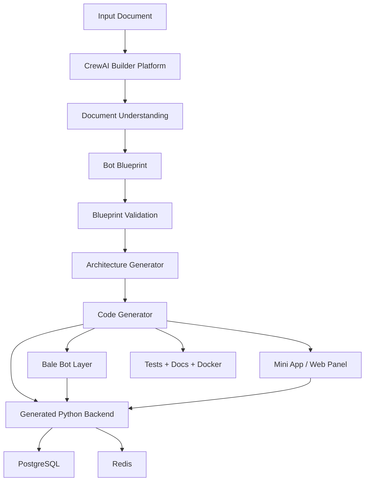
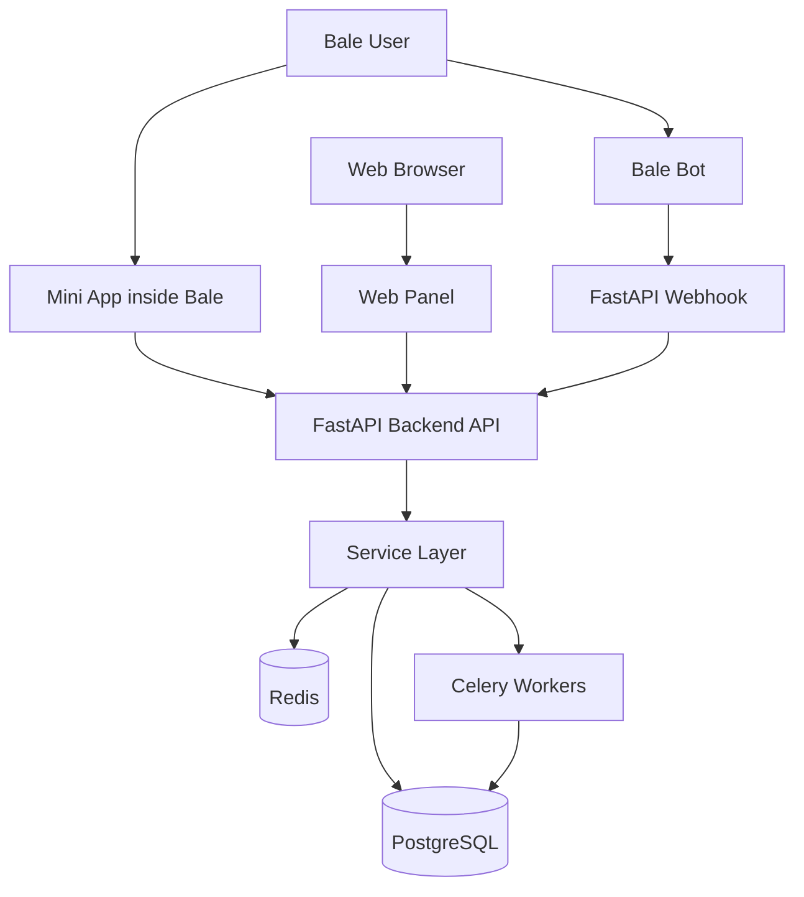
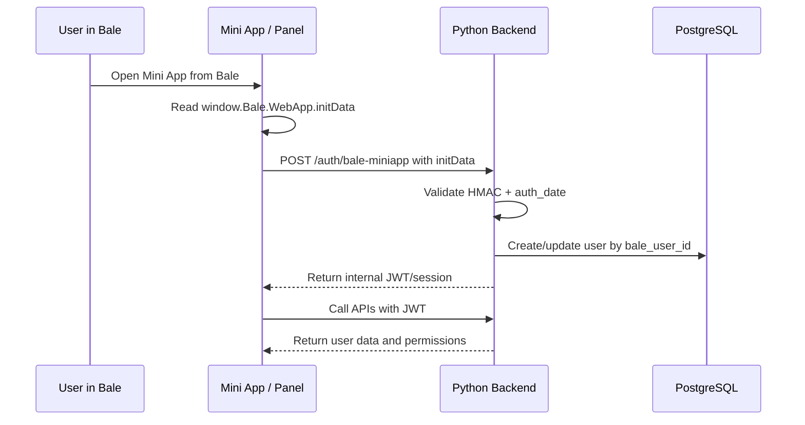
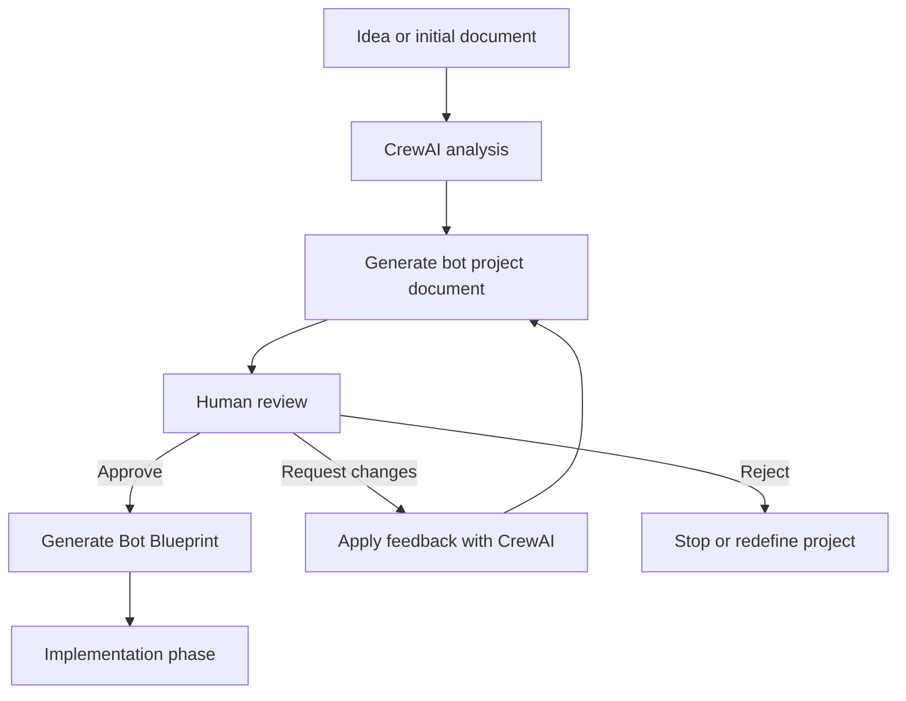
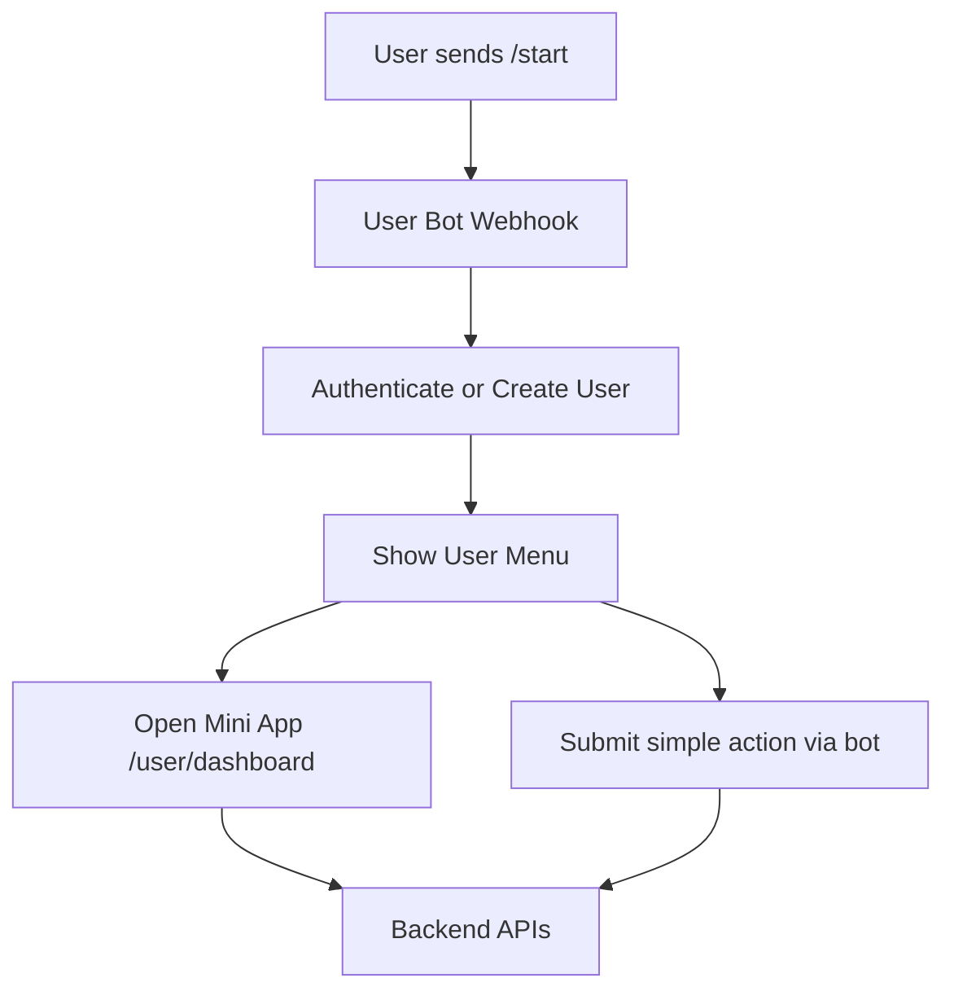
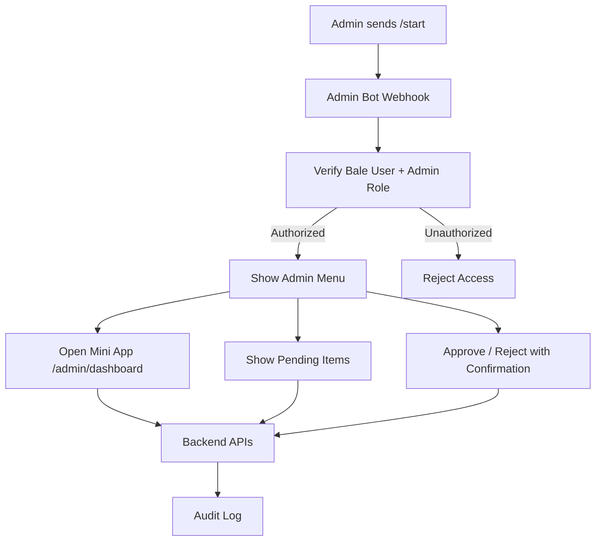
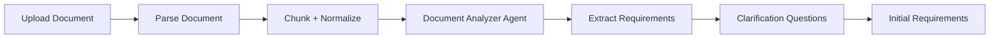
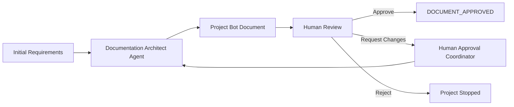
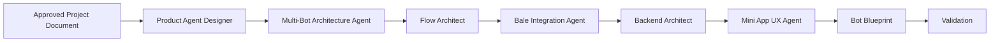
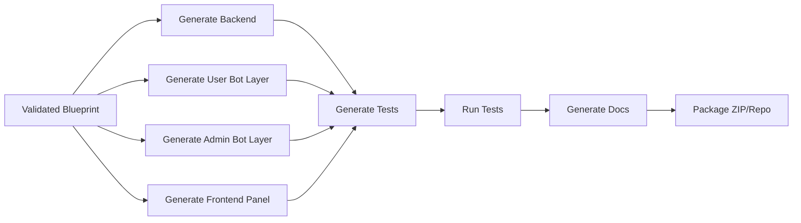

# Project Introduction and Architecture Document: AI-Assisted Bale Bot Project Builder with CrewAI

**Version:** 1.1  
**Date:** 1405/04/01 — 2026/06/21  
**Primary implementation language:** Python  
**Target platform:** Bale — Bale Bot + Bale Mini App  
**Document objective:** Present the idea, architecture, features, technologies, MVP, risks, development roadmap, multi-bot architecture, and Documentation First process for building a platform that generates Bale bot projects with the help of CrewAI.

---

## 1. Executive Summary

This project is an **AI-assisted Project Builder** platform for building Bale bot projects. A user or product team provides a project document containing requirements, product agents, flows, roles, forms, reports, and expected operations. The system uses **CrewAI** to analyze the document, produce a structured output called a **Bot Blueprint**, and then generate a complete project based on it. The generated project includes a Python backend, integration with Bale Bot API, a Mini App/Web Panel frontend, database, API, tests, and documentation.

In the improved version, the project follows the **Documentation First + Human Approval** pattern. This means CrewAI first generates a complete bot project document. This document includes the User Bot, Admin Bot, flows, Mini App/Panel, APIs, database, security, roles, and acceptance criteria. Only after human approval does the project enter the code generation and implementation phase.

The project must also support a **Multi-Bot** architecture. In the baseline scenario, there are two separate Bale bots: a **User Bot** for regular users and an **Admin Bot** for managers/operators. These two bots have separate tokens, webhooks, commands, and handlers, but they connect to the same backend, database, service layer, and shared frontend panel.

The main design point is that the **Mini App is treated as the same frontend panel running inside Bale**. In other words, a shared frontend panel is designed so that it can run both inside Bale as a Mini App and outside Bale as a Web Panel. The Bale bot acts as the message-based interface for notifications and operation entry points. The panel is used for complex operations, forms, lists, dashboards, and reports. The Python backend manages the core logic, authentication, permissions, and database.

---

## 2. Idea Definition

### 2.1 The problem this project solves

Building practical Bale bots is usually not limited to sending and receiving messages. Many projects require the following:

- designing conversation flows;
- defining roles and access levels;
- multi-step forms;
- reporting and dashboards;
- data persistence;
- integrations with external APIs;
- user, operator, or admin panels;
- a Mini App inside Bale;
- tests, documentation, and deployment.

Implementing all these steps manually is time-consuming, and output quality depends heavily on the implementation team’s skill. The goal of this project is to reduce the time needed for analysis, design, and initial project structure generation without sacrificing architectural control and quality.

### 2.2 Proposed solution

The proposed solution is a multi-stage system:

1. Receive the idea, initial description, or raw project document;
2. Analyze requirements with CrewAI;
3. Generate a complete bot project document including User Bot, Admin Bot, Mini App/Panel, API, database, security, and MVP;
4. Present the document for human review;
5. Receive approval, change requests, or rejection of the document;
6. If needed, have CrewAI revise the document and return to the review cycle;
7. After approval, create the standard Bot Blueprint;
8. Validate the Blueprint;
9. Decide where each capability should be implemented: User Bot, Admin Bot, Mini App/Panel, or Backend;
10. Generate the Python backend code;
11. Generate the Bale integration layer for the User Bot and Admin Bot;
12. Generate the frontend panel that can be used as both Mini App and Web Panel;
13. Generate tests, documentation, and deployment files.

---

## 3. Product Vision

### 3.1 Final product definition

**AI-Assisted Bale Bot Project Builder** is a platform for converting a project document into an executable system on Bale. The platform output is not just a simple bot; it is a complete project including:

- a Bale User Bot for messages, commands, inline keyboards, callbacks, and notifications;
- a Bale Admin Bot for management operations, alerts, approvals, and quick reports;
- a Mini App as the frontend panel inside Bale;
- a Web Panel outside Bale for direct browser access;
- a Python backend for APIs, database, logic, authentication, and permissions;
- database schema and migrations;
- backend, API, and bot flow tests;
- architecture and setup documentation;
- Docker files and `.env.example`.

### 3.2 Value proposition

| Audience | Created value |
|---|---|
| Product team | Rapidly converts ideas and documents into an executable architecture |
| Technical team | Receives a scaffolded project with a standard structure |
| Project manager | Reduces ambiguity, shortens analysis time, and improves output control |
| Client | Receives a faster and more scalable prototype |
| Bale developer | Gets a ready structure for bot + mini app + backend |

---

## 4. Project Scope

### 4.1 Part 1: Builder Platform

This is the core product. Its responsibility is to receive documents and generate project outputs.

Core capabilities:

- uploading project documents;
- analyzing documents with CrewAI;
- generating a complete bot project document;
- managing human review, revision, and approval of the document;
- generating the Bot Blueprint;
- validating the Blueprint;
- generating the architecture;
- generating backend code;
- generating bot adapter code;
- generating the frontend panel;
- generating tests;
- generating documentation;
- storing version history;
- exporting as ZIP or a ready repository.

### 4.2 Part 2: Generated Projects

Each generated project includes these components:

- Python backend;
- User Bale Bot webhook handler;
- Admin Bale Bot webhook handler;
- shared Bale API client with separate tokens;
- Mini App/Web Panel frontend;
- PostgreSQL database;
- Redis for state/cache;
- Celery for background jobs;
- Docker Compose;
- tests and documentation.

---

## 5. Conceptual Separation of Agents

The word “agent” must be used precisely in this project. There are two types of agents:

| Type | Description |
|---|---|
| Builder Agent | CrewAI agents that analyze documents, design, and generate code |
| Product Agent | Functional agents/modules inside the final bot, such as request registration, support, or reporting agents |

### 5.1 Proposed Builder Agents

| Agent | Responsibility |
|---|---|
| Document Analyzer Agent | Analyze the document and extract requirements |
| Documentation Architect Agent | Generate the complete project document before implementation |
| Human Approval Coordinator Agent | Prepare a reviewable version, apply feedback, and manage the approval cycle |
| Product Agent Designer | Design the Product Agents of the final bot |
| Flow Architect Agent | Design conversation and operation flows |
| Bale Integration Agent | Decide between Bot, Mini App, and Bale capabilities |
| Multi-Bot Architecture Agent | Detect the need for multiple bots and separate User Bot/Admin Bot commands, webhooks, and permissions |
| Backend Architect Agent | Design APIs, database, service layer, and permissions |
| Mini App UX Agent | Design panel pages and user journeys |
| Code Generator Agent | Generate project files |
| Test Generator Agent | Generate tests |
| Security Reviewer Agent | Review security, auth, validation, and RBAC |
| Documentation Agent | Generate documentation and README |

### 5.2 Sample Product Agents

| Product Agent | Use case |
|---|---|
| Support Agent | Create and track support tickets |
| Order Agent | Create orders and track their status |
| Appointment Agent | Book appointments |
| Reporting Agent | Show reports and outputs |
| Admin Agent | Management operations and settings |

---

## 6. Core Design Principle: What are the roles of Bot, Mini App, and Backend?

### 6.1 Bot role

The Bale bot is suitable for fast, message-based interaction and notifications:

- `/start`;
- sending welcome messages;
- showing options through inline keyboards;
- handling simple decisions;
- sending notifications;
- opening the Mini App;
- sending status updates;
- receiving callback queries;
- receiving `web_app_data` if needed.

### 6.2 Mini App / Panel role

The Mini App is the same frontend panel that opens inside Bale and can also be used outside Bale as a Web Panel:

- multi-step forms;
- dashboards;
- reports;
- lists;
- filters and search;
- user operations;
- operator operations;
- admin operations;
- profile;
- settings;
- viewing history and statuses.

### 6.3 Backend role

The backend is the only trusted place for the system’s core logic:

- business logic;
- API;
- database;
- authentication;
- authorization;
- RBAC;
- validation;
- audit log;
- integrations;
- background jobs;
- bot state;
- Mini App session.

### 6.4 Architecture rule

Core logic must not be duplicated in the bot or frontend. The bot and Mini App are only interfaces.

```text
Bale Bot Handler ─┐
                  ├── Backend Service Layer ── Database
MiniApp Panel ────┘
```

---

## 7. Decision Matrix: Bot vs. Mini App

| Capability type | Suitable location | Description |
|---|---|---|
| Welcome message | Bot | Simple and message-based |
| Selection from a few options | Bot | Inline keyboard is enough |
| Short form | Bot or Mini App | Depends on number of fields |
| Long form | Mini App | Better UX and stronger validation |
| Lists, filters, and search | Mini App | Poor user experience inside chat |
| Reports and charts | Mini App | Requires visual UI |
| Status notifications | Bot | Best notification channel |
| User management | Panel | Requires tables, actions, and permissions |
| System settings | Panel | Should be in management UI |
| Payment | Backend + Mini App + Bot | Backend controls it; bot notifies |
| Files and attachments | Mini App or Bot | Depends on scenario |
| Sensitive operations | Backend + Panel | Requires audit and confirmation |

---

## 8. High-Level System Architecture



---

## 9. Generated Project Architecture



---

## 10. Mini App Authentication Flow



Security note: the frontend must not trust `initDataUnsafe`. The raw `initData` must be sent to the backend, and the backend must validate the HMAC and `auth_date`.

---

## 11. Documentation First and Human Approval Process

### 11.1 Design principle

In this project, code generation must not happen directly from a raw document or the user’s initial description. The correct path is for CrewAI to first create a **complete bot project document**, and only after human approval should the implementation phase begin.

```text
Raw Idea / Initial Document
        ↓
CrewAI Documentation Builder
        ↓
Project Bot Document
        ↓
Human Review / Approval
        ↓
Bot Blueprint
        ↓
Implementation Builder
        ↓
Generated Project
```

This approach ensures that the project scope, flows, roles, two User/Admin bots, Mini App/Panel, APIs, database, security, and acceptance criteria are clear before code generation starts.

### 11.2 Documentation phase workflow



### 11.3 Content of the document generated by CrewAI

The bot project document must include at least these sections:

| Section | Description |
|---|---|
| Project introduction | Goal, problem, audience, and product value |
| Stakeholders | User, admin, operator, system manager, and custom roles |
| User Bot Spec | Capabilities, commands, flows, messages, and user scenarios |
| Admin Bot Spec | Capabilities, commands, alerts, sensitive operations, and access levels |
| Multi-Bot Architecture | Token, webhook, handler, command, and Mini App route separation for each bot |
| Mini App / Web Panel Spec | Pages, forms, dashboard, roles, and user/admin routes |
| Backend API Spec | Endpoints, services, auth, RBAC, and integrations |
| Database Design | Entities, relations, required migrations, and seed data |
| Security Spec | Bale authentication, internal JWT, HMAC, audit log, permissions |
| Notification Spec | Events, messages, admin alerts, and user notifications |
| MVP Scope | First-version features and out-of-scope items |
| Acceptance Criteria | Testable acceptance criteria for each feature |
| Implementation Plan | Implementation phases, outputs, and dependencies |

### 11.4 Project statuses in the Builder

For step-by-step control, each project must have an explicit status:

```text
DRAFT_CREATED
DOCUMENT_GENERATING
DOCUMENT_DRAFTED
DOCUMENT_REVIEW_PENDING
DOCUMENT_CHANGE_REQUESTED
DOCUMENT_APPROVED
BLUEPRINT_GENERATING
BLUEPRINT_VALIDATED
IMPLEMENTATION_GENERATING
IMPLEMENTATION_REVIEW_PENDING
IMPLEMENTATION_APPROVED
READY_FOR_DEPLOY
DEPLOYED
```

Execution rule:

> Until the project status is `DOCUMENT_APPROVED`, the code generation phase must not run.

### 11.5 Human decisions during review

| Decision | Effect |
|---|---|
| Approve | Continue to Blueprint generation and then implementation |
| Request Changes | Return to CrewAI to revise the document |
| Reject | Stop the project or redefine the idea |
| Split Scope | Split scope into MVP and later phases |
| Freeze Scope | Lock the scope to prevent scope creep |

### 11.6 Documentation phase outputs

The output can be a single file or multiple structured files:

```text
docs/project_bot_document.md
docs/01_project_overview.md
docs/02_roles_and_permissions.md
docs/03_user_bot_spec.md
docs/04_admin_bot_spec.md
docs/05_miniapp_panel_spec.md
docs/06_backend_api_spec.md
docs/07_database_design.md
docs/08_security_and_auth.md
docs/09_notification_and_events.md
docs/10_mvp_scope.md
docs/11_acceptance_criteria.md
docs/12_implementation_plan.md
```

### 11.7 Business value of Documentation First

This phase is itself a sellable deliverable. The project can be offered in two stages:

| Stage | Output | Value |
|---|---|---|
| Stage 1 | Bot project analysis and design document | Reduces ambiguity, defines scope, enables accurate pricing |
| Stage 2 | Project implementation | Generates code after scope and architecture approval |

---

## 12. Multi-Bot Architecture: User Bot and Admin Bot

### 12.1 Design principle

In many real projects, one bot for all users is not enough. For projects with management operations, it is better to have two separate bots:

| Bot | Audience | Use case |
|---|---|---|
| User Bot | Regular users | Start, submit requests, track, receive notifications, enter user panel |
| Admin Bot | Admins and operators | View alerts, review requests, approve/reject, quick reports, enter admin panel |

These two bots must not be two separate systems. The correct architecture is:

```text
User Bale Bot ─────┐
                   ├── Shared Python Backend ── Service Layer ── Database
Admin Bale Bot ────┘
                   └── Shared MiniApp / Web Panel
```

### 12.2 Differences between the two bots

| Topic | User Bot | Admin Bot |
|---|---|---|
| token | `BALE_USER_BOT_TOKEN` | `BALE_ADMIN_BOT_TOKEN` |
| webhook | `/webhooks/bale/user-bot` | `/webhooks/bale/admin-bot` |
| audience | user/customer | admin/operator |
| commands | `/start`, `/status`, `/request` | `/start`, `/pending`, `/reports`, `/users` |
| Mini App route | `/user/dashboard` | `/admin/dashboard` |
| permission | user roles | admin/operator roles only |
| security | normal + session | stricter + audit + confirmation |
| main use | service usage | management and supervision |

### 12.3 User Bot flow



### 12.4 Admin Bot flow



### 12.5 Backend structure for multiple bots

```text
backend/app/bot/
  bale/
    client.py
    models.py
    router.py
    webhook.py
    keyboards.py

    user_bot/
      handlers/
        start.py
        requests.py
        profile.py
        notifications.py
      commands.py
      keyboards.py

    admin_bot/
      handlers/
        start.py
        approvals.py
        reports.py
        users.py
        alerts.py
      commands.py
      keyboards.py

    shared/
      state.py
      permissions.py
      miniapp.py
      messages.py
      idempotency.py
```

### 12.6 Webhooks

```text
POST /webhooks/bale/user-bot
POST /webhooks/bale/admin-bot
```

Or, in a more generic form:

```text
POST /webhooks/bale/{bot_key}
```

`bot_key` must only accept registered and allowed values. To prevent spoofing, each `bot_key` must have its own token and settings.

### 12.7 Proposed environment variables

```env
BALE_USER_BOT_TOKEN=replace_me
BALE_ADMIN_BOT_TOKEN=replace_me

BALE_USER_BOT_WEBHOOK_URL=https://api.example.com/webhooks/bale/user-bot
BALE_ADMIN_BOT_WEBHOOK_URL=https://api.example.com/webhooks/bale/admin-bot

FRONTEND_BASE_URL=https://panel.example.com
MINIAPP_USER_URL=https://panel.example.com/user/dashboard
MINIAPP_ADMIN_URL=https://panel.example.com/admin/dashboard
```

### 12.8 Admin Bot security

The Admin Bot must be more restricted and auditable:

- only users with admin or operator roles may use it;
- `bale_user_id` must match an internal user and allowed roles;
- sensitive operations such as approve, reject, delete, bulk send, or settings changes must require confirmation;
- all management operations must be recorded in `audit_logs`;
- the Admin Bot token must be stored separately and securely;
- if an unauthorized user sends a message to the Admin Bot, internal system details must not be disclosed.

### 12.9 Impact of multi-bot architecture on the CrewAI Builder

During analysis and documentation, CrewAI must answer these questions:

| Question | Expected output |
|---|---|
| Does the project need a separate Admin Bot? | `multi_bot.enabled=true` |
| Which operations belong to User Bot? | User commands and flows |
| Which operations belong to Admin Bot? | Commands, alerts, and approval flows |
| Which Mini App routes are for users? | `/user/*` |
| Which Mini App routes are for admins? | `/admin/*` |
| Which roles are allowed to use Admin Bot? | `admin`, `operator`, or custom roles |
| Which operations require confirmation and audit? | security rules and audit policy |

---

## 13. Bot Blueprint

### 13.1 Blueprint role

The Bot Blueprint is the intermediate layer between the raw document and code generation. Generating code directly from the raw document is dangerous because the document may be incomplete or ambiguous. The Blueprint makes the AI output controllable, validatable, and testable.

### 13.2 Sample Blueprint structure

```yaml
project:
  name: support_bot
  platform: bale
  backend: fastapi
  frontend: miniapp_panel
  generation_mode: documentation_first

workflow:
  documentation_required: true
  human_approval_required: true
  implementation_starts_after: DOCUMENT_APPROVED

actors:
  - customer
  - operator
  - admin

bots:
  - key: user_bot
    title: User Bot
    audience: users
    token_env: BALE_USER_BOT_TOKEN
    webhook_path: /webhooks/bale/user-bot
    allowed_roles: [customer]
    miniapp_default_route: /user/dashboard
    commands:
      - /start
      - /request
      - /status

  - key: admin_bot
    title: Admin Bot
    audience: admins
    token_env: BALE_ADMIN_BOT_TOKEN
    webhook_path: /webhooks/bale/admin-bot
    allowed_roles: [admin, operator]
    miniapp_default_route: /admin/dashboard
    commands:
      - /start
      - /pending
      - /reports
      - /users

product_agents:
  - name: support_agent
    purpose: Create and track support requests
    channels:
      user_bot: true
      admin_bot: true
      miniapp: true
    flows:
      - create_ticket
      - track_ticket
      - admin_review_ticket

flows:
  create_ticket:
    entry_points:
      - bot: user_bot
        command: /request
      - miniapp_route: /user/tickets/new
    steps:
      - ask_subject
      - ask_description
      - upload_attachment
      - confirm
      - create_record
    backend_services:
      - ticket_service.create_ticket

  admin_review_ticket:
    entry_points:
      - bot: admin_bot
        command: /pending
      - miniapp_route: /admin/tickets
    steps:
      - list_pending_items
      - open_ticket
      - approve_or_reject
      - write_audit_log
    backend_services:
      - ticket_service.review_ticket

api:
  endpoints:
    - method: POST
      path: /api/tickets
      auth: required
      roles: [customer, admin]
    - method: POST
      path: /api/admin/tickets/{id}/review
      auth: required
      roles: [admin, operator]

database:
  tables:
    - users
    - roles
    - permissions
    - bale_accounts
    - bots
    - tickets
    - ticket_messages
    - audit_logs

miniapp:
  pages:
    - /user/dashboard
    - /user/tickets
    - /user/tickets/new
    - /admin/dashboard
    - /admin/tickets
    - /admin/users
    - /admin/reports
```

### 13.3 Main Blueprint entities

| Entity | Description |
|---|---|
| ProjectSpec | General project specifications |
| AgentSpec | Product Agent specifications |
| FlowSpec | Conversation and operation flows |
| RoleSpec | Roles |
| PermissionSpec | Permissions |
| EntitySpec | Data models |
| ApiEndpointSpec | APIs |
| MiniAppPageSpec | Panel pages |
| BotSpec | Specifications of each bot, including `token_env`, webhook, audience, and allowed roles |
| BotCommandSpec | Commands and callbacks |
| IntegrationSpec | External service integrations |

---

## 14. Proposed Technologies

### 14.1 Builder Platform technologies

| Area | Proposed technology | Reason |
|---|---|---|
| Primary language | Python 3.12+ | Compatible with CrewAI, FastAPI, and AI tooling |
| Agent orchestration | CrewAI + CrewAI Flows | Suitable for multi-stage workflows, state, and branching |
| Platform API | FastAPI | Fast, async, suitable for backend and AI pipeline |
| Validation | Pydantic v2 | Define and validate Blueprint |
| Database | PostgreSQL | Store projects, blueprints, and history |
| ORM | SQLAlchemy 2.x | Better control over models |
| Migration | Alembic | Manage database schema changes |
| Queue | Celery + Redis | Run time-consuming tasks |
| File storage | MinIO/S3-compatible | Store documents and generated outputs |
| Template engine | Jinja2 | Generate project files |
| Code quality | Ruff + Black + mypy | Standardize generated code |
| Test runner | pytest | Test the generator and generated projects |
| Deployment | Docker + Docker Compose | Fast and repeatable setup |
| Observability | structlog + OpenTelemetry + Sentry | Monitoring, tracing, and error management |

### 14.2 Generated project technologies

| Area | Proposed technology |
|---|---|
| Backend | FastAPI |
| Language | Python 3.12+ |
| ORM | SQLAlchemy |
| Migration | Alembic |
| DB | PostgreSQL |
| Cache/state | Redis |
| Background jobs | Celery |
| HTTP client | httpx |
| Config | pydantic-settings |
| Auth | JWT + Bale initData validation |
| Permissions | Internal RBAC |
| Tests | pytest + pytest-asyncio |
| Deployment | Docker + docker-compose |

### 14.3 Frontend / Mini App / Panel technologies

| Area | Proposed technology |
|---|---|
| Framework | Next.js or React + Vite |
| Language | TypeScript |
| UI | Tailwind CSS + shadcn/ui |
| API state | TanStack Query |
| Forms | React Hook Form + Zod |
| Routing inside Mini App | Memory Router for better compatibility with Bale WebView |
| Charts | Recharts or ECharts |
| Auth client | JWT/session adapter |
| Theme | Support for Bale `themeParams` |

### 14.4 Bale Bot technologies

| Area | Recommended choice |
|---|---|
| Webhook server | FastAPI route |
| Bale API client | Direct `httpx.AsyncClient` |
| Update models | Pydantic |
| Handler routing | Internal router/dispatcher |
| State | Redis + PostgreSQL |
| Idempotency | `processed_updates` table or Redis key |
| Retry | tenacity or internal retry |
| Logging | structlog |
| File handling | multipart/form-data through httpx |
| Security | token in env, webhook secret/path, internal validation |

### 14.5 Note about ready-made Bale SDKs

Ready-made Python SDKs for Bale can be evaluated for prototypes, but for a generator product, the main recommendation is to use a **direct HTTP client with httpx**. Reasons:

- full control over output structure;
- reduced dependency risk;
- better testability;
- predictable generated code;
- ability to develop adapters for Telegram or other platforms later;
- stronger control over retry, logging, idempotency, and error handling.

---

## 15. Proposed Generated Project Repository Structure

```text
generated_project/
  backend/
    app/
      main.py
      core/
        config.py
        security.py
        logging.py
      db/
        session.py
        base.py
        migrations/
      models/
        user.py
        role.py
        permission.py
        audit_log.py
      schemas/
        user.py
        auth.py
      api/
        deps.py
        routes/
          auth.py
          users.py
          dashboard.py
      services/
        user_service.py
        auth_service.py
      bot/
        bale/
          client.py
          models.py
          webhook.py
          router.py
          keyboards.py
          shared/
            state.py
            permissions.py
            miniapp.py
            idempotency.py
          user_bot/
            commands.py
            keyboards.py
            handlers/
              start.py
              requests.py
              profile.py
              notifications.py
          admin_bot/
            commands.py
            keyboards.py
            handlers/
              start.py
              approvals.py
              reports.py
              users.py
              alerts.py
      miniapp/
        auth.py
        init_data.py
      workers/
        celery_app.py
        tasks.py
    tests/
      test_auth.py
      test_users.py
      test_bot_webhook.py
      test_miniapp_auth.py
    Dockerfile
    pyproject.toml

  frontend/
    src/
      app/
      pages/
      components/
      features/
      lib/
        api.ts
        auth.ts
        bale.ts
      routes/
    package.json
    Dockerfile

  docs/
    project_bot_document.md
    architecture.md
    api_contract.yaml
    bot_blueprint.yaml
    user_bot_spec.md
    admin_bot_spec.md

  docker-compose.yml
  .env.example
  README.md
```

---

## 16. Proposed Builder Platform Repository Structure

```text
bale-bot-builder/
  app/
    main.py
    core/
      config.py
      security.py
      logging.py
    db/
      session.py
      models.py
      migrations/
    api/
      routes/
        projects.py
        documents.py
        blueprints.py
        generator.py
    crews/
      document_analyzer/
      documentation_architect/
      human_approval_coordinator/
      product_agent_designer/
      multi_bot_architect/
      flow_architect/
      backend_architect/
      bale_integration/
      frontend_architect/
      test_generator/
      security_reviewer/
    flows/
      documentation_flow.py
      approval_flow.py
      project_builder_flow.py
    schemas/
      blueprint.py
      agent_spec.py
      flow_spec.py
      project_spec.py
    generator/
      renderer.py
      templates/
        backend/
        frontend/
        docs/
        docker/
      validators.py
      packager.py
    services/
      document_service.py
      blueprint_service.py
      generation_service.py
      ai_run_service.py
    workers/
      celery_app.py
      tasks.py
  tests/
  docker-compose.yml
  pyproject.toml
  README.md
```

---

## 17. Main Builder System Flows

### 17.1 Document intake and analysis flow



### 17.2 Document generation and human approval flow



### 17.3 Blueprint generation flow



### 17.4 Project generation flow



---

## 18. Main Builder Platform APIs

| Method | Path | Description |
|---|---|---|
| POST | /projects | Create a new project |
| POST | /projects/{id}/documents | Upload a document |
| POST | /projects/{id}/analyze | Start document analysis |
| GET | /projects/{id}/requirements | Get extracted requirements |
| POST | /projects/{id}/document/generate | Generate the complete bot project document |
| GET | /projects/{id}/document | View the bot project document |
| POST | /projects/{id}/document/feedback | Submit document change feedback |
| POST | /projects/{id}/document/approve | Human approval of the document and permission to enter the next phase |
| POST | /projects/{id}/blueprint | Generate Blueprint |
| GET | /projects/{id}/blueprint | View Blueprint |
| POST | /projects/{id}/validate | Validate Blueprint |
| POST | /projects/{id}/generate | Generate project |
| GET | /projects/{id}/runs | View run history |
| GET | /projects/{id}/download | Download generated project output |

---

## 19. Base APIs of the Generated Project

| Method | Path | Description |
|---|---|---|
| POST | /auth/bale-miniapp | Authenticate Mini App using initData |
| POST | /webhooks/bale/user-bot | Receive Bale webhook from User Bot |
| POST | /webhooks/bale/admin-bot | Receive Bale webhook from Admin Bot |
| GET | /me | Current user information |
| GET | /permissions/me | Current user permissions |
| GET | /dashboard | Dashboard information |
| GET | /admin/users | Manage users |
| POST | /admin/users/{id}/activate | Activate user |
| POST | /admin/users/{id}/deactivate | Deactivate user |
| GET | /audit-logs | View operation logs |

Project-specific APIs are generated based on the Blueprint.

---

## 20. Security Model

### 20.1 Authentication

- Login from Mini App using Bale initData;
- HMAC validation in the backend;
- checking `auth_date` to prevent replay;
- creating or updating the internal user;
- issuing a short-lived internal JWT;
- refresh/session in Redis or DB.

### 20.2 Permissions

Proposed RBAC model:

```text
User ── UserRole ── Role ── RolePermission ── Permission
```

Sample permissions:

- `dashboard.view`
- `ticket.create`
- `ticket.view_own`
- `ticket.manage_all`
- `user.manage`
- `report.view`
- `settings.manage`

### 20.3 Audit Log

All sensitive operations must be audited:

- user login;
- role changes;
- data creation/editing/deletion;
- settings changes;
- admin operations;
- sensitive callback received from the bot.

### 20.4 Bot Webhook security

- use an unguessable webhook path;
- store token in env;
- record `update_id`s to prevent duplicate processing;
- structured logging for all updates;
- controlled timeout and retry for message sending;
- handle Bale API errors.

---

## 21. Base Data Model

### 21.1 General tables of the generated project

| Table | Use |
|---|---|
| users | Internal system users |
| roles | Roles |
| permissions | Permissions |
| user_roles | User-role relationship |
| role_permissions | Role-permission relationship |
| bale_accounts | Mapping internal users to Bale users |
| bots | Project bot definitions such as `user_bot` and `admin_bot` |
| bot_conversations | Bot conversation state for each `bot_key` |
| processed_updates | Prevent duplicate update processing |
| audit_logs | Operation logs |
| app_settings | Project settings |

### 21.2 Project-specific tables

Generated based on the Blueprint. For example, for a ticket project:

| Table | Use |
|---|---|
| tickets | Requests |
| ticket_messages | Messages for each request |
| ticket_attachments | Attachments |
| ticket_status_history | Status history |

---

## 22. Core MVP Capabilities

The MVP must be limited, testable, and presentable. Proposed MVP:

### 22.1 Builder capabilities in MVP

- receive Markdown or DOCX documents;
- extract roles, flows, and capabilities;
- generate the complete bot project document;
- review, feedback, and approval of the document;
- generate Bot Blueprint after document approval;
- view and initially edit the Blueprint;
- generate FastAPI backend;
- generate Bale webhook and httpx client for User Bot and Admin Bot;
- generate simple Mini App/Panel;
- generate Docker Compose;
- generate README and `architecture.md`;
- generate base tests.

### 22.2 MVP limitations

For the first version, it is better to exclude:

- support for every type of project;
- automatic production deployment;
- visual flow editor;
- payment;
- multiple messaging platforms;
- complex UI;
- many integrations;
- runtime agents inside the generated project.

### 22.3 Suitable MVP scope

Three initial templates are enough:

1. ticket and support system;
2. form and request registration system;
3. simple appointment booking system.

---

## 23. Future Capabilities

### 23.1 Phase 2

- visual flow editor;
- diff between Blueprint versions;
- ERD generation;
- complete OpenAPI generation;
- support for files and attachments;
- support for notification schedules;
- GitHub integration;
- automatic Pull Request creation;
- end-to-end tests for Mini App.

### 23.2 Phase 3

- Telegram support alongside Bale;
- marketplace of ready templates;
- sandbox for running generated projects;
- semi-automated deployment;
- multi-tenant builder;
- complete observability for generated projects;
- AI review for generated code;
- automatic security scanning.

---

## 24. Outputs for Clients or Investors

| Output | Description |
|---|---|
| Demo Builder | Document upload and Blueprint generation page |
| Sample Generated Project | Sample output project for a ticket scenario |
| User Bot Demo | Bale user bot with commands and inline keyboards |
| Admin Bot Demo | Bale admin bot with management commands and access control |
| Mini App Demo | Panel inside Bale |
| Web Panel Demo | Same panel outside Bale |
| Architecture Document | Architecture documentation |
| Project Bot Document | Reviewable document before implementation |
| Bot Blueprint | Reviewable YAML/JSON file |
| API Docs | Backend OpenAPI |
| Test Report | Test results of the generated project |

---

## 25. Risks and Mitigations

| Risk | Impact | Mitigation |
|---|---|---|
| Input document is incomplete | Wrong output is generated | Add clarification and human approval stage |
| Bypassing the document phase | Code generated from incorrect interpretation | Lock implementation until status is `DOCUMENT_APPROVED` |
| User Bot and Admin Bot are not separated | UX confusion and weaker management security | Define Multi-Bot Architecture in Blueprint and separate tokens/webhooks |
| Direct AI code generation is unstable | Non-runnable code | Generate from Blueprint + templates, not raw text |
| Logic is duplicated in bot and panel | Hard maintenance | Keep all logic in backend service layer |
| Mini App security is weak | User spoofing or replay | HMAC + auth_date validation + internal JWT |
| Dependency on ready-made Bale SDK | Technical/legal risk | Use direct httpx client |
| Scope becomes too large | MVP failure | Start with 2 or 3 defined templates |
| Insufficient tests | Unreliable output | Mandatory test generation and automatic execution |
| AI debugging is difficult | Reduced control | Store prompt, model, raw output, Blueprint, and test report |

---

## 26. Success Metrics

| Metric | Proposed MVP target |
|---|---|
| Time to generate bot project document | Less than 5 minutes for a simple document |
| Document approval rate on first review | At least 70% for template scenarios |
| Time to convert approved document into Blueprint | Less than 3 minutes for a simple document |
| Time to generate project | Less than 10 minutes for an MVP project |
| Passing tests in generated project | At least 80% in MVP, above 95% in stable version |
| Number of supported templates | 3 templates in MVP |
| Generated project can run with Docker Compose | 100% |
| Mini App login with Bale initData | Mandatory |
| Panel usable both inside and outside Bale | Mandatory |

---

## 27. Proposed Implementation Phases

### Phase 0: Base design

- define Documentation First and Human Approval cycle;
- define Bot Blueprint schema;
- define base templates;
- design Builder architecture;
- design generated project architecture;
- define coding and testing standards.

### Phase 1: MVP

- FastAPI Builder;
- CrewAI document analysis flow;
- bot project document generation;
- add review/approve flow;
- Blueprint generation after approval;
- simple FastAPI project generation;
- User Bot and Admin Bot webhook and httpx client generation;
- simple React/Next panel generation;
- Docker Compose;
- base tests.

### Phase 2: Quality and expansion

- Blueprint editing;
- more tests;
- support for multiple templates;
- GitHub integration;
- build and test reports;
- automatic security review.

### Phase 3: Productization

- multi-tenant support;
- user and plan management;
- template marketplace;
- observability;
- semi-automated deployment;
- support for other messaging platforms.

---

## 28. Blind Spots and Decision Points

### 28.1 The project should not try to build “any bot” from day one

This claim is too large for an MVP. It is better to focus first on limited and recurring scenarios.

### 28.2 CrewAI should not replace architecture

CrewAI should orchestrate analysis, design, generation, and review. The generation logic must be controlled with schema, templates, validation, and tests.

### 28.3 The Mini App must not be a separate part from the panel

The best design is for the Mini App to be the same frontend panel running inside Bale WebView. The difference is only execution mode, authentication, and routing.

### 28.4 Using a ready-made Bale SDK in the product core is risky

It is acceptable for prototypes, but for a serious product, a direct httpx client is more controllable.

### 28.5 Tests must be mandatory output

Any generated project without tests must not be considered acceptable output.

### 28.6 Code generation without document approval must not be allowed

If the system directly generates code from the initial description, the risk of locking a wrong interpretation into code is high. Documentation First must be a mandatory gate before implementation.

### 28.7 The Admin Bot must not be only an admin menu inside the User Bot

For operational security and user experience, the Admin Bot must have its own token, webhook, handlers, commands, and policies, while keeping the backend and service layer shared.

---

## 29. Final Summary

From a product perspective, this project can go beyond a simple “bot builder” and become a **platform for generating complete systems on Bale**. The correct version of the idea is:

> The user enters an idea or initial project document. The platform first uses CrewAI to generate the complete bot project document. This document includes the User Bot, Admin Bot, flows, roles, panel pages, APIs, database, security, MVP, and acceptance criteria. After human review and approval, a standard Bot Blueprint is generated and validated. In the next stage, a complete project is generated, including Python backend, User Bale Bot, Admin Bale Bot, Mini App/Web Panel, database, tests, Docker, and documentation.

The key architectural decisions are:

- User Bot is used for messages, commands, callbacks, user operations, and notifications;
- Admin Bot is used for management operations, alerts, approval flows, and quick reports;
- Mini App is the same frontend panel inside Bale;
- Web Panel is the same frontend outside Bale;
- Python backend is the main location for logic, data, security, and APIs;
- CrewAI acts as builder/orchestrator;
- code generation happens from a valid Bot Blueprint and approved document, not directly from the raw document.

---

## 30. Official and Technical References

- CrewAI Flows Documentation: https://docs.crewai.com/en/concepts/flows
- CrewAI First Flow Guide: https://docs.crewai.com/en/guides/flows/first-flow
- Bale Bot API Documentation: https://docs.bale.ai/
- Bale Mini App Documentation: https://docs.bale.ai/miniapp
- FastAPI Documentation: https://fastapi.tiangolo.com/
- Pydantic Documentation: https://docs.pydantic.dev/
- SQLAlchemy Documentation: https://docs.sqlalchemy.org/
- Alembic Documentation: https://alembic.sqlalchemy.org/
- Celery Documentation: https://docs.celeryq.dev/
- Redis Documentation: https://redis.io/docs/
- Next.js Documentation: https://nextjs.org/docs
- React Documentation: https://react.dev/
- TanStack Query Documentation: https://tanstack.com/query/latest
- Tailwind CSS Documentation: https://tailwindcss.com/docs
