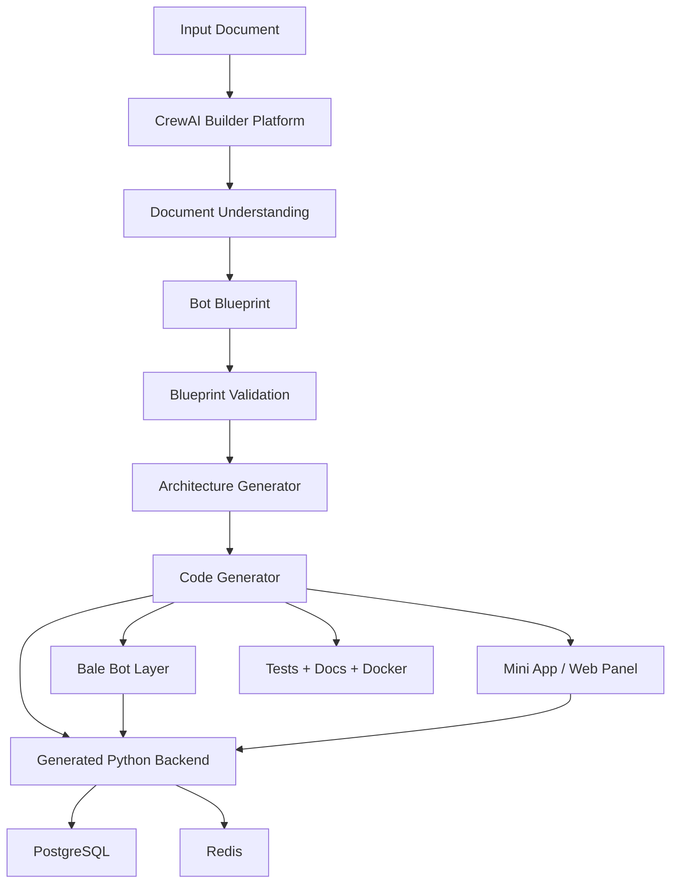
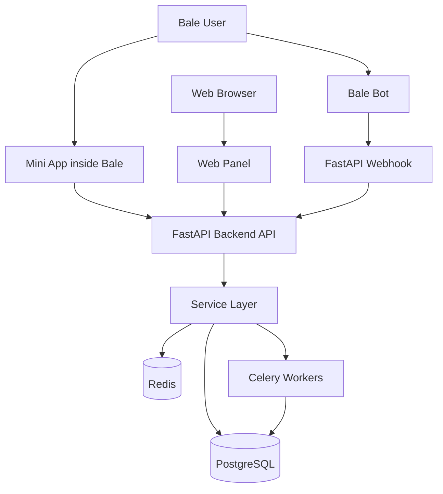
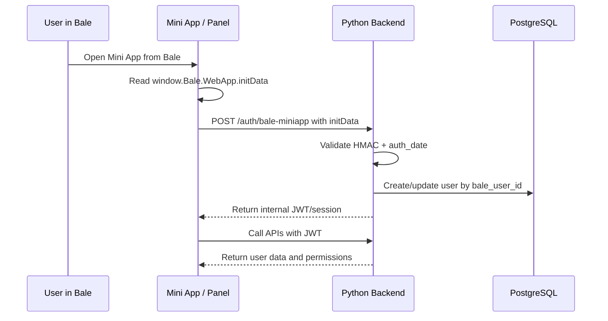
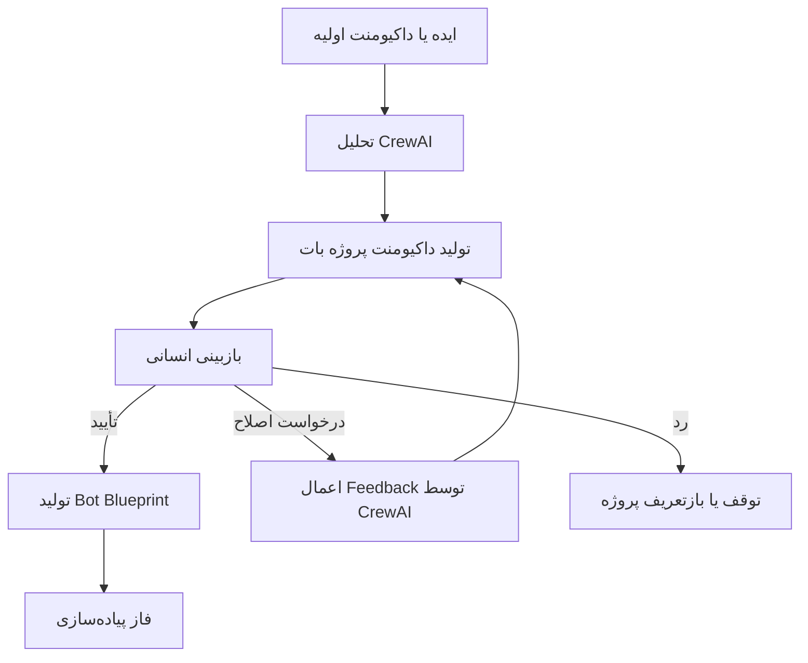
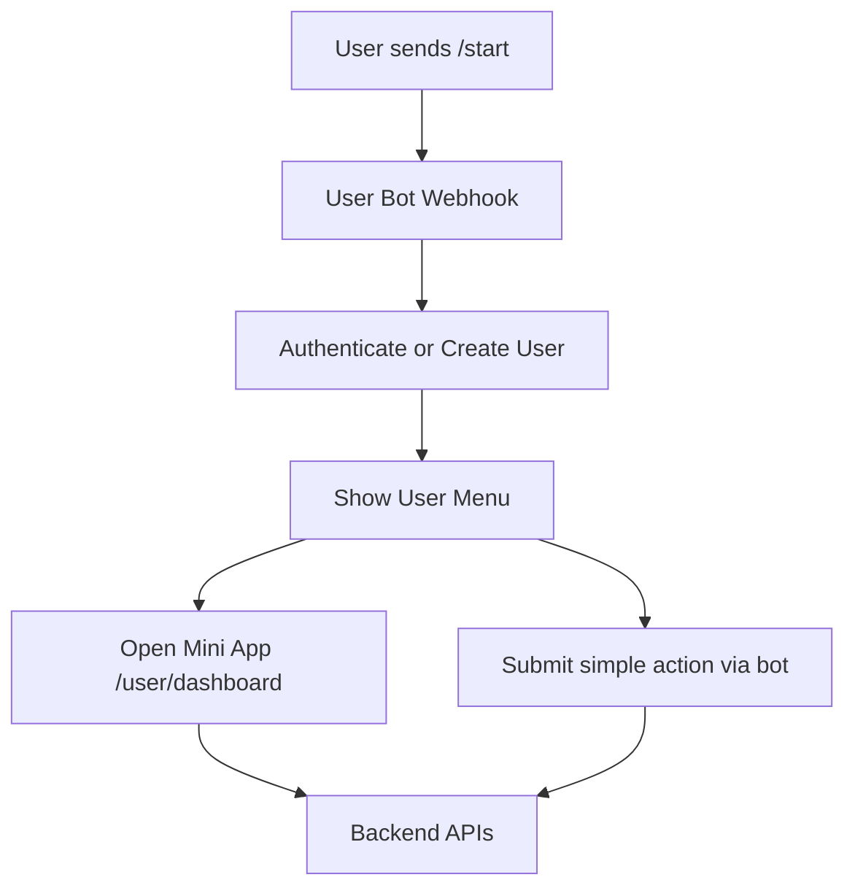
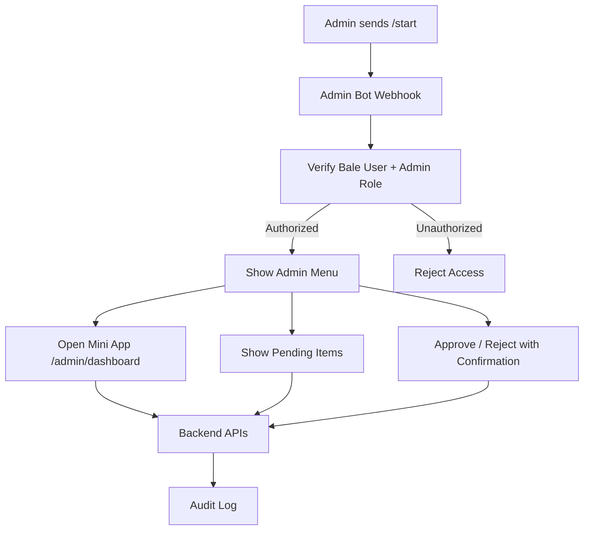
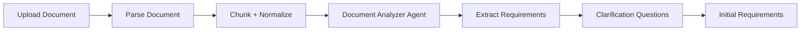
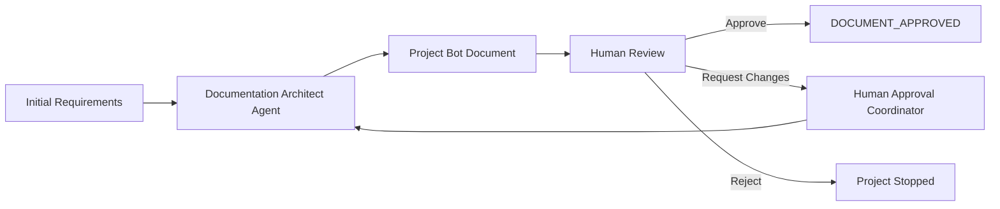
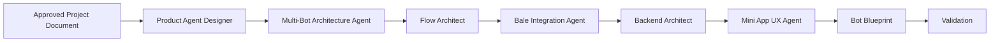
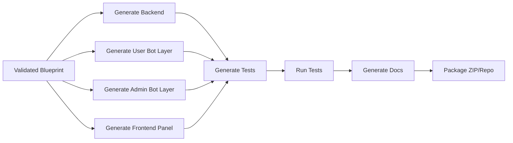

# سند معرفی و معماری پروژه: AI-Assisted Bale Bot Project Builder با CrewAI

**نسخه:** 1.1  
**تاریخ:** 1405/04/01 — 2026/06/21  
**زبان پیاده‌سازی اصلی:** Python  
**پلتفرم هدف:** بله — Bale Bot + Bale Mini App  
**هدف سند:** ارائه ایده، معماری، امکانات، تکنولوژی‌ها، MVP، ریسک‌ها، مسیر توسعه، معماری چندباتی و فرآیند Documentation First برای ساخت پلتفرم تولید پروژه‌های بات بله با کمک CrewAI.

---

## 1. خلاصه مدیریتی

این پروژه یک پلتفرم **AI-assisted Project Builder** برای ساخت پروژه‌های بات بله است. کاربر یا تیم محصول، یک داکیومنت پروژه شامل نیازمندی‌ها، ایجنت‌های محصول، فلوها، نقش‌ها، فرم‌ها، گزارش‌ها و عملیات مورد انتظار را وارد می‌کند. سیستم با استفاده از **CrewAI** داکیومنت را تحلیل می‌کند، خروجی ساختاریافته‌ای به نام **Bot Blueprint** تولید می‌کند و سپس بر اساس آن یک پروژه کامل شامل backend پایتون، اتصال به Bot API بله، پنل Mini App/Web Panel، دیتابیس، API، تست‌ها و مستندات ایجاد می‌کند.

در نسخه بهبود‌یافته، پروژه از الگوی **Documentation First + Human Approval** استفاده می‌کند. یعنی CrewAI ابتدا داکیومنت کامل پروژه بات را تولید می‌کند؛ این داکیومنت شامل بات کاربر، بات ادمین، فلوها، Mini App/Panel، APIها، دیتابیس، امنیت، نقش‌ها و معیار پذیرش است. فقط بعد از تأیید انسانی، پروژه وارد فاز تولید کد و پیاده‌سازی می‌شود.

همچنین پروژه باید از معماری **Multi-Bot** پشتیبانی کند. در سناریوی پایه، دو بات جداگانه بله وجود دارد: **User Bot** برای کاربران عادی و **Admin Bot** برای مدیران/اپراتورها. این دو بات token، webhook، commandها و handlerهای جدا دارند، اما به یک backend، دیتابیس، service layer و پنل frontend مشترک متصل می‌شوند.

نکته اصلی در طراحی این محصول این است که **Mini App به‌عنوان همان پنل فرانت داخل بله** در نظر گرفته می‌شود. یعنی یک پنل frontend مشترک طراحی می‌شود که هم داخل بله به‌صورت Mini App اجرا می‌شود و هم خارج از بله به‌صورت Web Panel قابل استفاده است. بات بله نقش interface پیام‌محور، اعلان و شروع عملیات را دارد؛ پنل برای عملیات پیچیده، فرم‌ها، لیست‌ها، داشبورد و گزارش‌ها استفاده می‌شود؛ و backend پایتون منطق اصلی، احراز هویت، مجوزها و دیتابیس را مدیریت می‌کند.

---

## 2. تعریف ایده

### 2.1 مسئله‌ای که پروژه حل می‌کند

ساخت بات‌های کاربردی برای بله معمولاً فقط به ارسال و دریافت پیام محدود نیست. بسیاری از پروژه‌ها نیازمند موارد زیر هستند:

- طراحی فلوهای مکالمه؛
- تعریف نقش‌ها و سطوح دسترسی؛
- فرم‌های چندمرحله‌ای؛
- گزارش‌گیری و داشبورد؛
- ذخیره‌سازی داده‌ها؛
- ارتباط با APIهای بیرونی؛
- پنل کاربر، اپراتور یا ادمین؛
- Mini App داخل بله؛
- تست، مستندات و deployment.

اجرای دستی همه این مراحل زمان‌بر است و کیفیت خروجی وابسته به مهارت تیم پیاده‌سازی می‌شود. هدف این پروژه کاهش زمان تحلیل، طراحی و تولید ساختار اولیه پروژه است؛ بدون اینکه کنترل معماری و کیفیت قربانی شود.

### 2.2 راه‌حل پیشنهادی

راه‌حل پیشنهادی یک سیستم چندمرحله‌ای است:

1. دریافت ایده، توضیح اولیه یا داکیومنت خام پروژه؛
2. تحلیل نیازمندی‌ها با CrewAI؛
3. تولید داکیومنت کامل پروژه بات شامل User Bot، Admin Bot، Mini App/Panel، API، دیتابیس، امنیت و MVP؛
4. ارائه داکیومنت برای بازبینی انسانی؛
5. دریافت تأیید، درخواست اصلاح یا رد داکیومنت؛
6. در صورت نیاز، اصلاح داکیومنت توسط CrewAI و بازگشت به چرخه review؛
7. بعد از تأیید، ساخت Bot Blueprint استاندارد؛
8. اعتبارسنجی Blueprint؛
9. تصمیم‌گیری درباره اینکه هر قابلیت در User Bot، Admin Bot، Mini App/Panel یا Backend پیاده‌سازی شود؛
10. تولید کد backend پایتون؛
11. تولید لایه اتصال به بله برای User Bot و Admin Bot؛
12. تولید پنل frontend قابل استفاده به‌عنوان Mini App و Web Panel؛
13. تولید تست‌ها، مستندات و فایل‌های deployment.

---

## 3. چشم‌انداز محصول

### 3.1 تعریف محصول نهایی

**AI-Assisted Bale Bot Project Builder** یک پلتفرم برای تبدیل داکیومنت پروژه به یک سیستم اجرایی روی بله است. خروجی این پلتفرم فقط یک بات ساده نیست؛ بلکه یک پروژه کامل شامل موارد زیر است:

- بات بله کاربر برای پیام، command، inline keyboard، callback و notification؛
- بات بله ادمین برای عملیات مدیریتی، هشدارها، تأییدها و گزارش‌های سریع؛
- Mini App به‌عنوان پنل frontend داخل بله؛
- Web Panel خارج از بله برای دسترسی مستقیم از مرورگر؛
- backend پایتون برای API، دیتابیس، منطق، احراز هویت و permission؛
- ساختار دیتابیس و migration؛
- تست‌های backend، API و bot flow؛
- مستندات معماری و راه‌اندازی؛
- فایل‌های Docker و env.example.

### 3.2 ارزش پیشنهادی

| مخاطب | ارزش ایجادشده |
|---|---|
| تیم محصول | تبدیل سریع ایده و داکیومنت به معماری قابل اجرا |
| تیم فنی | دریافت پروژه scaffold شده با ساختار استاندارد |
| مدیر پروژه | کاهش ابهام، کاهش زمان تحلیل، افزایش قابلیت کنترل خروجی |
| کارفرما | دریافت نمونه اولیه سریع‌تر و قابل توسعه‌تر |
| توسعه‌دهنده بله | داشتن ساختار آماده برای bot + mini app + backend |

---

## 4. دامنه پروژه

### 4.1 بخش اول: پلتفرم Builder

این بخش خود محصول اصلی است و وظیفه دارد داکیومنت را دریافت کند و خروجی پروژه تولید کند.

امکانات اصلی:

- بارگذاری داکیومنت پروژه؛
- تحلیل داکیومنت با CrewAI؛
- تولید داکیومنت کامل پروژه بات؛
- مدیریت بازبینی، اصلاح و تأیید انسانی داکیومنت؛
- تولید Bot Blueprint؛
- اعتبارسنجی Blueprint؛
- تولید معماری؛
- تولید کد backend؛
- تولید کد bot adapter؛
- تولید پنل frontend؛
- تولید تست؛
- تولید مستندات؛
- ذخیره history نسخه‌ها؛
- خروجی ZIP یا repository آماده.

### 4.2 بخش دوم: پروژه‌های خروجی

هر پروژه خروجی شامل این اجزا است:

- Python backend؛
- User Bale Bot webhook handler؛
- Admin Bale Bot webhook handler؛
- Bale API client مشترک با tokenهای جدا؛
- Mini App/Web Panel frontend؛
- PostgreSQL database؛
- Redis برای state/cache؛
- Celery برای کارهای پس‌زمینه؛
- Docker Compose؛
- تست‌ها و مستندات.

---

## 5. تفکیک مفهومی ایجنت‌ها

در این پروژه واژه «ایجنت» باید دقیق استفاده شود. دو نوع ایجنت وجود دارد:

| نوع | توضیح |
|---|---|
| Builder Agent | ایجنت‌های CrewAI که داکیومنت را تحلیل، طراحی و کد تولید می‌کنند |
| Product Agent | ایجنت‌ها/ماژول‌های عملکردی داخل بات نهایی؛ مثل ایجنت ثبت درخواست، پشتیبانی، گزارش‌گیری |

### 5.1 Builder Agents پیشنهادی

| Agent | وظیفه |
|---|---|
| Document Analyzer Agent | تحلیل داکیومنت و استخراج نیازمندی‌ها |
| Documentation Architect Agent | تولید داکیومنت کامل پروژه قبل از پیاده‌سازی |
| Human Approval Coordinator Agent | آماده‌سازی نسخه قابل review، اعمال feedback و مدیریت چرخه تأیید |
| Product Agent Designer | طراحی Product Agentهای بات نهایی |
| Flow Architect Agent | طراحی فلوهای مکالمه و عملیات |
| Bale Integration Agent | تصمیم‌گیری درباره Bot، Mini App و قابلیت‌های بله |
| Multi-Bot Architecture Agent | تشخیص نیاز به چند بات، تفکیک User Bot و Admin Bot، commandها، webhookها و دسترسی‌ها |
| Backend Architect Agent | طراحی API، دیتابیس، service layer و permission |
| Mini App UX Agent | طراحی صفحات پنل و user journey |
| Code Generator Agent | تولید فایل‌های پروژه |
| Test Generator Agent | تولید تست‌ها |
| Security Reviewer Agent | بررسی امنیت، auth، validation و RBAC |
| Documentation Agent | تولید مستندات و README |

### 5.2 Product Agents نمونه

| Product Agent | کاربرد |
|---|---|
| Support Agent | ثبت و پیگیری تیکت |
| Order Agent | ثبت سفارش و پیگیری وضعیت |
| Appointment Agent | رزرو نوبت |
| Reporting Agent | نمایش گزارش‌ها و خروجی‌ها |
| Admin Agent | عملیات مدیریتی و تنظیمات |

---

## 6. اصل طراحی: Bot، Mini App و Backend چه نقشی دارند؟

### 6.1 نقش Bot

بات بله برای تعامل سریع، پیام‌محور و notification مناسب است:

- /start؛
- ارسال پیام خوشامد؛
- نمایش گزینه‌ها با inline keyboard؛
- گرفتن تصمیم‌های ساده؛
- ارسال اعلان؛
- باز کردن Mini App؛
- ارسال وضعیت؛
- دریافت callback query؛
- دریافت web_app_data در صورت نیاز.

### 6.2 نقش Mini App / Panel

Mini App همان پنل frontend است که داخل بله باز می‌شود و خارج از بله نیز به‌صورت Web Panel قابل استفاده است:

- فرم‌های چندمرحله‌ای؛
- داشبورد؛
- گزارش‌ها؛
- لیست‌ها؛
- فیلتر و جستجو؛
- عملیات کاربر؛
- عملیات اپراتور؛
- عملیات ادمین؛
- پروفایل؛
- تنظیمات؛
- مشاهده history و وضعیت‌ها.

### 6.3 نقش Backend

Backend تنها محل معتبر برای منطق اصلی سیستم است:

- business logic؛
- API؛
- database؛
- authentication؛
- authorization؛
- RBAC؛
- validation؛
- audit log؛
- integration؛
- background jobs؛
- bot state؛
- Mini App session.

### 6.4 قانون معماری

منطق اصلی نباید در بات یا frontend تکرار شود. بات و Mini App فقط interface هستند.

```text
Bale Bot Handler ─┐
                  ├── Backend Service Layer ── Database
MiniApp Panel ────┘
```

---

## 7. ماتریس تصمیم‌گیری Bot در برابر Mini App

| نوع قابلیت | محل مناسب | توضیح |
|---|---|---|
| پیام خوشامد | Bot | ساده و پیام‌محور |
| انتخاب از چند گزینه | Bot | inline keyboard کافی است |
| فرم کوتاه | Bot یا Mini App | بسته به تعداد فیلدها |
| فرم طولانی | Mini App | UX بهتر و validation کامل‌تر |
| لیست، فیلتر و جستجو | Mini App | در پیام‌رسان تجربه ضعیف است |
| گزارش و نمودار | Mini App | نیازمند UI تصویری |
| اعلان وضعیت | Bot | بهترین کانال notification |
| مدیریت کاربران | Panel | نیازمند table، action و permission |
| تنظیمات سیستم | Panel | باید در UI مدیریتی باشد |
| پرداخت | Backend + Mini App + Bot | backend کنترل کند، bot اطلاع‌رسانی کند |
| فایل و پیوست | Mini App یا Bot | بسته به سناریو |
| عملیات حساس | Backend + Panel | نیازمند audit و confirmation |

---

## 8. معماری کلان سیستم



---

## 9. معماری پروژه خروجی



---

## 10. جریان احراز هویت Mini App



نکته امنیتی: frontend نباید به `initDataUnsafe` اعتماد کند. داده خام `initData` باید به backend ارسال شود و backend اعتبارسنجی HMAC و `auth_date` را انجام دهد.

---


## 11. فرآیند Documentation First و تأیید انسانی

### 11.1 اصل طراحی

در این پروژه، تولید کد نباید مستقیماً از روی داکیومنت خام یا توضیح اولیه کاربر انجام شود. مسیر درست این است که CrewAI ابتدا یک **داکیومنت کامل پروژه بات** بسازد و سپس بعد از تأیید انسانی، فاز پیاده‌سازی آغاز شود.

```text
Raw Idea / Initial Document
        ↓
CrewAI Documentation Builder
        ↓
Project Bot Document
        ↓
Human Review / Approval
        ↓
Bot Blueprint
        ↓
Implementation Builder
        ↓
Generated Project
```

این روش باعث می‌شود قبل از تولید کد، scope پروژه، فلوها، نقش‌ها، دو بات کاربر/ادمین، Mini App/Panel، APIها، دیتابیس، امنیت و معیار پذیرش شفاف شوند.

### 11.2 چرخه کاری فاز مستندسازی



### 11.3 محتوای داکیومنت تولیدشده توسط CrewAI

داکیومنت پروژه بات باید حداقل شامل این بخش‌ها باشد:

| بخش | توضیح |
|---|---|
| معرفی پروژه | هدف، مسئله، مخاطب و ارزش محصول |
| ذی‌نفعان | کاربر، ادمین، اپراتور، مدیر سیستم و نقش‌های سفارشی |
| User Bot Spec | قابلیت‌ها، commandها، flowها، پیام‌ها و سناریوهای کاربر |
| Admin Bot Spec | قابلیت‌ها، commandها، هشدارها، عملیات حساس و سطوح دسترسی |
| Multi-Bot Architecture | تفکیک token، webhook، handler، command و routeهای Mini App برای هر بات |
| Mini App / Web Panel Spec | صفحات، فرم‌ها، داشبورد، نقش‌ها و مسیرهای user/admin |
| Backend API Spec | endpointها، سرویس‌ها، auth، RBAC و integrationها |
| Database Design | موجودیت‌ها، relationها، migrationهای لازم و داده‌های پایه |
| Security Spec | احراز هویت بله، JWT داخلی، HMAC، audit log، permissionها |
| Notification Spec | رویدادها، پیام‌ها، هشدارهای ادمین و اعلان‌های کاربر |
| MVP Scope | امکانات نسخه اول و موارد خارج از محدوده |
| Acceptance Criteria | معیارهای پذیرش قابل تست برای هر قابلیت |
| Implementation Plan | فازهای پیاده‌سازی، خروجی‌ها و وابستگی‌ها |

### 11.4 وضعیت‌های پروژه در Builder

برای کنترل مرحله‌ای، پروژه باید status مشخص داشته باشد:

```text
DRAFT_CREATED
DOCUMENT_GENERATING
DOCUMENT_DRAFTED
DOCUMENT_REVIEW_PENDING
DOCUMENT_CHANGE_REQUESTED
DOCUMENT_APPROVED
BLUEPRINT_GENERATING
BLUEPRINT_VALIDATED
IMPLEMENTATION_GENERATING
IMPLEMENTATION_REVIEW_PENDING
IMPLEMENTATION_APPROVED
READY_FOR_DEPLOY
DEPLOYED
```

قانون اجرایی:

> تا زمانی که وضعیت پروژه `DOCUMENT_APPROVED` نشده باشد، فاز تولید کد نباید اجرا شود.

### 11.5 تصمیم‌های انسانی در مرحله review

| تصمیم | اثر |
|---|---|
| Approve | ورود به تولید Blueprint و سپس پیاده‌سازی |
| Request Changes | بازگشت به CrewAI برای اصلاح داکیومنت |
| Reject | توقف پروژه یا بازتعریف ایده |
| Split Scope | تقسیم scope به MVP و فازهای بعدی |
| Freeze Scope | قفل کردن محدوده برای جلوگیری از scope creep |

### 11.6 خروجی‌های فاز مستندسازی

خروجی می‌تواند به‌صورت یک فایل واحد یا چند فایل ساختاریافته باشد:

```text
docs/project_bot_document.md
docs/01_project_overview.md
docs/02_roles_and_permissions.md
docs/03_user_bot_spec.md
docs/04_admin_bot_spec.md
docs/05_miniapp_panel_spec.md
docs/06_backend_api_spec.md
docs/07_database_design.md
docs/08_security_and_auth.md
docs/09_notification_and_events.md
docs/10_mvp_scope.md
docs/11_acceptance_criteria.md
docs/12_implementation_plan.md
```

### 11.7 مزیت تجاری Documentation First

این فاز خودش یک deliverable قابل فروش است. می‌توان پروژه را دو مرحله‌ای ارائه کرد:

| مرحله | خروجی | ارزش |
|---|---|---|
| مرحله ۱ | داکیومنت تحلیل و طراحی پروژه بات | کاهش ابهام، تعیین scope، امکان قیمت‌گذاری دقیق |
| مرحله ۲ | پیاده‌سازی پروژه | تولید کد بعد از تأیید محدوده و معماری |

---

## 12. معماری چندباتی: User Bot و Admin Bot

### 12.1 اصل طراحی

در بسیاری از پروژه‌های واقعی، یک بات برای همه کاربران کافی نیست. برای پروژه‌های دارای عملیات مدیریتی، بهتر است دو بات جدا وجود داشته باشد:

| بات | مخاطب | کاربرد |
|---|---|---|
| User Bot | کاربران عادی | شروع کار، ثبت درخواست، پیگیری، دریافت اعلان، ورود به پنل کاربر |
| Admin Bot | ادمین‌ها و اپراتورها | مشاهده هشدارها، بررسی درخواست‌ها، تأیید/رد، گزارش سریع، ورود به پنل ادمین |

این دو بات نباید دو سیستم جدا باشند. معماری درست این است:

```text
User Bale Bot ─────┐
                   ├── Shared Python Backend ── Service Layer ── Database
Admin Bale Bot ────┘
                   └── Shared MiniApp / Web Panel
```

### 12.2 تفاوت دو بات

| موضوع | User Bot | Admin Bot |
|---|---|---|
| token | `BALE_USER_BOT_TOKEN` | `BALE_ADMIN_BOT_TOKEN` |
| webhook | `/webhooks/bale/user-bot` | `/webhooks/bale/admin-bot` |
| audience | user/customer | admin/operator |
| commandها | `/start`, `/status`, `/request` | `/start`, `/pending`, `/reports`, `/users` |
| Mini App route | `/user/dashboard` | `/admin/dashboard` |
| مجوز | roleهای کاربری | فقط roleهای admin/operator |
| امنیت | معمولی + session | سخت‌گیرانه‌تر + audit + confirmation |
| کاربرد اصلی | service usage | management and supervision |

### 12.3 جریان User Bot



### 12.4 جریان Admin Bot



### 12.5 ساختار backend برای چند بات

```text
backend/app/bot/
  bale/
    client.py
    models.py
    router.py
    webhook.py
    keyboards.py

    user_bot/
      handlers/
        start.py
        requests.py
        profile.py
        notifications.py
      commands.py
      keyboards.py

    admin_bot/
      handlers/
        start.py
        approvals.py
        reports.py
        users.py
        alerts.py
      commands.py
      keyboards.py

    shared/
      state.py
      permissions.py
      miniapp.py
      messages.py
      idempotency.py
```

### 12.6 Webhookها

```text
POST /webhooks/bale/user-bot
POST /webhooks/bale/admin-bot
```

یا در حالت عمومی‌تر:

```text
POST /webhooks/bale/{bot_key}
```

`bot_key` باید فقط مقادیر مجاز و ثبت‌شده داشته باشد. برای جلوگیری از spoofing، هر bot_key باید token و تنظیمات مستقل داشته باشد.

### 12.7 env پیشنهادی

```env
BALE_USER_BOT_TOKEN=replace_me
BALE_ADMIN_BOT_TOKEN=replace_me

BALE_USER_BOT_WEBHOOK_URL=https://api.example.com/webhooks/bale/user-bot
BALE_ADMIN_BOT_WEBHOOK_URL=https://api.example.com/webhooks/bale/admin-bot

FRONTEND_BASE_URL=https://panel.example.com
MINIAPP_USER_URL=https://panel.example.com/user/dashboard
MINIAPP_ADMIN_URL=https://panel.example.com/admin/dashboard
```

### 12.8 امنیت Admin Bot

Admin Bot باید محدودتر و قابل audit باشد:

- فقط کاربران دارای role ادمین یا اپراتور اجازه استفاده داشته باشند؛
- `bale_user_id` باید با user داخلی و roleهای مجاز تطبیق داده شود؛
- عملیات حساس مثل تأیید، رد، حذف، ارسال انبوه یا تغییر تنظیمات باید confirmation داشته باشد؛
- همه عملیات مدیریتی باید در `audit_logs` ثبت شود؛
- token بات ادمین باید جدا و محرمانه نگهداری شود؛
- اگر یک پیام از Admin Bot از کاربر غیرمجاز دریافت شد، جزئیات داخلی سیستم نباید افشا شود.

### 12.9 اثر معماری چندباتی روی CrewAI Builder

CrewAI باید در فاز تحلیل و مستندسازی به این سؤال‌ها پاسخ دهد:

| سؤال | خروجی مورد انتظار |
|---|---|
| آیا پروژه به Admin Bot جدا نیاز دارد؟ | `multi_bot.enabled=true` |
| چه عملیات‌هایی مخصوص User Bot هستند؟ | commandها و flowهای کاربری |
| چه عملیات‌هایی مخصوص Admin Bot هستند؟ | commandها، alertها و approval flowها |
| کدام routeهای Mini App برای کاربر است؟ | `/user/*` |
| کدام routeهای Mini App برای ادمین است؟ | `/admin/*` |
| چه roleهایی اجازه کار با Admin Bot دارند؟ | `admin`, `operator` یا نقش‌های سفارشی |
| چه عملیات‌هایی نیازمند confirmation و audit هستند؟ | security rules و audit policy |


## 13. Bot Blueprint

### 13.1 نقش Blueprint

Bot Blueprint لایه میانی بین داکیومنت خام و تولید کد است. تولید کد مستقیم از داکیومنت خام خطرناک است، چون داکیومنت ممکن است ناقص یا مبهم باشد. Blueprint باعث می‌شود خروجی AI قابل کنترل، قابل اعتبارسنجی و قابل تست باشد.

### 13.2 ساختار نمونه Blueprint

```yaml
project:
  name: support_bot
  platform: bale
  backend: fastapi
  frontend: miniapp_panel
  generation_mode: documentation_first

workflow:
  documentation_required: true
  human_approval_required: true
  implementation_starts_after: DOCUMENT_APPROVED

actors:
  - customer
  - operator
  - admin

bots:
  - key: user_bot
    title: بات کاربران
    audience: users
    token_env: BALE_USER_BOT_TOKEN
    webhook_path: /webhooks/bale/user-bot
    allowed_roles: [customer]
    miniapp_default_route: /user/dashboard
    commands:
      - /start
      - /request
      - /status

  - key: admin_bot
    title: بات مدیران
    audience: admins
    token_env: BALE_ADMIN_BOT_TOKEN
    webhook_path: /webhooks/bale/admin-bot
    allowed_roles: [admin, operator]
    miniapp_default_route: /admin/dashboard
    commands:
      - /start
      - /pending
      - /reports
      - /users

product_agents:
  - name: support_agent
    purpose: ثبت و پیگیری درخواست پشتیبانی
    channels:
      user_bot: true
      admin_bot: true
      miniapp: true
    flows:
      - create_ticket
      - track_ticket
      - admin_review_ticket

flows:
  create_ticket:
    entry_points:
      - bot: user_bot
        command: /request
      - miniapp_route: /user/tickets/new
    steps:
      - ask_subject
      - ask_description
      - upload_attachment
      - confirm
      - create_record
    backend_services:
      - ticket_service.create_ticket

  admin_review_ticket:
    entry_points:
      - bot: admin_bot
        command: /pending
      - miniapp_route: /admin/tickets
    steps:
      - list_pending_items
      - open_ticket
      - approve_or_reject
      - write_audit_log
    backend_services:
      - ticket_service.review_ticket

api:
  endpoints:
    - method: POST
      path: /api/tickets
      auth: required
      roles: [customer, admin]
    - method: POST
      path: /api/admin/tickets/{id}/review
      auth: required
      roles: [admin, operator]

database:
  tables:
    - users
    - roles
    - permissions
    - bale_accounts
    - bots
    - tickets
    - ticket_messages
    - audit_logs

miniapp:
  pages:
    - /user/dashboard
    - /user/tickets
    - /user/tickets/new
    - /admin/dashboard
    - /admin/tickets
    - /admin/users
    - /admin/reports
```

### 13.3 موجودیت‌های اصلی Blueprint

| Entity | توضیح |
|---|---|
| ProjectSpec | مشخصات کلی پروژه |
| AgentSpec | مشخصات Product Agentها |
| FlowSpec | فلوهای مکالمه و عملیات |
| RoleSpec | نقش‌ها |
| PermissionSpec | دسترسی‌ها |
| EntitySpec | مدل‌های داده |
| ApiEndpointSpec | APIها |
| MiniAppPageSpec | صفحات پنل |
| BotSpec | مشخصات هر بات، token_env، webhook، audience و roleهای مجاز |
| BotCommandSpec | commandها و callbackها |
| IntegrationSpec | اتصال به سرویس‌های بیرونی |

---

## 14. تکنولوژی‌های پیشنهادی

### 14.1 تکنولوژی‌های پلتفرم Builder

| بخش | تکنولوژی پیشنهادی | دلیل |
|---|---|---|
| زبان اصلی | Python 3.12+ | هماهنگ با CrewAI، FastAPI و AI tooling |
| Agent orchestration | CrewAI + CrewAI Flows | مناسب workflow چندمرحله‌ای، state و branching |
| API پلتفرم | FastAPI | سریع، async، مناسب backend و AI pipeline |
| Validation | Pydantic v2 | تعریف و اعتبارسنجی Blueprint |
| Database | PostgreSQL | ذخیره پروژه‌ها، blueprintها و history |
| ORM | SQLAlchemy 2.x | کنترل بهتر روی مدل‌ها |
| Migration | Alembic | مدیریت تغییرات دیتابیس |
| Queue | Celery + Redis | اجرای taskهای زمان‌بر |
| File storage | MinIO/S3-compatible | ذخیره داکیومنت و خروجی پروژه |
| Template engine | Jinja2 | تولید فایل‌های پروژه |
| Code quality | Ruff + Black + mypy | استانداردسازی خروجی کد |
| Test runner | pytest | تست generator و پروژه خروجی |
| Deployment | Docker + Docker Compose | راه‌اندازی سریع و قابل تکرار |
| Observability | structlog + OpenTelemetry + Sentry | رصد، trace و مدیریت خطا |

### 14.2 تکنولوژی‌های پروژه خروجی

| بخش | تکنولوژی پیشنهادی |
|---|---|
| Backend | FastAPI |
| Language | Python 3.12+ |
| ORM | SQLAlchemy |
| Migration | Alembic |
| DB | PostgreSQL |
| Cache/state | Redis |
| Background jobs | Celery |
| HTTP client | httpx |
| Config | pydantic-settings |
| Auth | JWT + Bale initData validation |
| Permissions | RBAC داخلی |
| Tests | pytest + pytest-asyncio |
| Deployment | Docker + docker-compose |

### 14.3 تکنولوژی‌های Frontend / Mini App / Panel

| بخش | تکنولوژی پیشنهادی |
|---|---|
| Framework | Next.js یا React + Vite |
| Language | TypeScript |
| UI | Tailwind CSS + shadcn/ui |
| API state | TanStack Query |
| Forms | React Hook Form + Zod |
| Routing داخل Mini App | Memory Router برای سازگاری بهتر با WebView بله |
| Charts | Recharts یا ECharts |
| Auth client | JWT/session adapter |
| Theme | پشتیبانی از themeParams بله |

### 14.4 تکنولوژی‌های Bot بله

| بخش | انتخاب پیشنهادی |
|---|---|
| Webhook server | FastAPI route |
| Bale API client | httpx.AsyncClient مستقیم |
| Update models | Pydantic |
| Handler routing | Internal router/dispatcher |
| State | Redis + PostgreSQL |
| Idempotency | جدول processed_updates یا Redis key |
| Retry | tenacity یا retry داخلی |
| Logging | structlog |
| File handling | multipart/form-data از طریق httpx |
| Security | token در env، webhook secret/path، validation داخلی |

### 14.5 نکته درباره SDKهای آماده بله

برای prototype می‌توان SDKهای آماده پایتونی بله را بررسی کرد، اما برای محصول generator، پیشنهاد اصلی استفاده از **کلاینت مستقیم HTTP با httpx** است. دلیل:

- کنترل کامل روی ساختار خروجی؛
- کاهش ریسک وابستگی؛
- تست‌پذیری بهتر؛
- امکان تولید کد قابل پیش‌بینی؛
- امکان توسعه adapter برای Telegram یا پلتفرم‌های دیگر در آینده؛
- کنترل بهتر روی retry، logging، idempotency و error handling.

---

## 15. ساختار پیشنهادی repository پروژه خروجی

```text
generated_project/
  backend/
    app/
      main.py
      core/
        config.py
        security.py
        logging.py
      db/
        session.py
        base.py
        migrations/
      models/
        user.py
        role.py
        permission.py
        audit_log.py
      schemas/
        user.py
        auth.py
      api/
        deps.py
        routes/
          auth.py
          users.py
          dashboard.py
      services/
        user_service.py
        auth_service.py
      bot/
        bale/
          client.py
          models.py
          webhook.py
          router.py
          keyboards.py
          shared/
            state.py
            permissions.py
            miniapp.py
            idempotency.py
          user_bot/
            commands.py
            keyboards.py
            handlers/
              start.py
              requests.py
              profile.py
              notifications.py
          admin_bot/
            commands.py
            keyboards.py
            handlers/
              start.py
              approvals.py
              reports.py
              users.py
              alerts.py
      miniapp/
        auth.py
        init_data.py
      workers/
        celery_app.py
        tasks.py
    tests/
      test_auth.py
      test_users.py
      test_bot_webhook.py
      test_miniapp_auth.py
    Dockerfile
    pyproject.toml

  frontend/
    src/
      app/
      pages/
      components/
      features/
      lib/
        api.ts
        auth.ts
        bale.ts
      routes/
    package.json
    Dockerfile

  docs/
    project_bot_document.md
    architecture.md
    api_contract.yaml
    bot_blueprint.yaml
    user_bot_spec.md
    admin_bot_spec.md

  docker-compose.yml
  .env.example
  README.md
```

---

## 16. ساختار پیشنهادی repository پلتفرم Builder

```text
bale-bot-builder/
  app/
    main.py
    core/
      config.py
      security.py
      logging.py
    db/
      session.py
      models.py
      migrations/
    api/
      routes/
        projects.py
        documents.py
        blueprints.py
        generator.py
    crews/
      document_analyzer/
      documentation_architect/
      human_approval_coordinator/
      product_agent_designer/
      multi_bot_architect/
      flow_architect/
      backend_architect/
      bale_integration/
      frontend_architect/
      test_generator/
      security_reviewer/
    flows/
      documentation_flow.py
      approval_flow.py
      project_builder_flow.py
    schemas/
      blueprint.py
      agent_spec.py
      flow_spec.py
      project_spec.py
    generator/
      renderer.py
      templates/
        backend/
        frontend/
        docs/
        docker/
      validators.py
      packager.py
    services/
      document_service.py
      blueprint_service.py
      generation_service.py
      ai_run_service.py
    workers/
      celery_app.py
      tasks.py
  tests/
  docker-compose.yml
  pyproject.toml
  README.md
```

---

## 17. فلوهای اصلی سیستم Builder

### 17.1 Flow دریافت و تحلیل داکیومنت



### 17.2 Flow تولید داکیومنت و تأیید انسانی



### 17.3 Flow تولید Blueprint



### 17.4 Flow تولید پروژه



---

## 18. APIهای اصلی پلتفرم Builder

| Method | Path | توضیح |
|---|---|---|
| POST | /projects | ایجاد پروژه جدید |
| POST | /projects/{id}/documents | بارگذاری داکیومنت |
| POST | /projects/{id}/analyze | شروع تحلیل داکیومنت |
| GET | /projects/{id}/requirements | دریافت نیازمندی‌های استخراج‌شده |
| POST | /projects/{id}/document/generate | تولید داکیومنت کامل پروژه بات |
| GET | /projects/{id}/document | مشاهده داکیومنت پروژه بات |
| POST | /projects/{id}/document/feedback | ثبت درخواست اصلاح داکیومنت |
| POST | /projects/{id}/document/approve | تأیید انسانی داکیومنت و اجازه ورود به فاز بعد |
| POST | /projects/{id}/blueprint | تولید Blueprint |
| GET | /projects/{id}/blueprint | مشاهده Blueprint |
| POST | /projects/{id}/validate | اعتبارسنجی Blueprint |
| POST | /projects/{id}/generate | تولید پروژه |
| GET | /projects/{id}/runs | مشاهده history اجراها |
| GET | /projects/{id}/download | دانلود خروجی پروژه |

---

## 19. APIهای پایه پروژه خروجی

| Method | Path | توضیح |
|---|---|---|
| POST | /auth/bale-miniapp | احراز هویت Mini App با initData |
| POST | /webhooks/bale/user-bot | دریافت webhook بات کاربر از بله |
| POST | /webhooks/bale/admin-bot | دریافت webhook بات ادمین از بله |
| GET | /me | اطلاعات کاربر فعلی |
| GET | /permissions/me | دسترسی‌های کاربر |
| GET | /dashboard | اطلاعات داشبورد |
| GET | /admin/users | مدیریت کاربران |
| POST | /admin/users/{id}/activate | فعال‌سازی کاربر |
| POST | /admin/users/{id}/deactivate | غیرفعال‌سازی کاربر |
| GET | /audit-logs | مشاهده لاگ عملیات |

APIهای اختصاصی هر پروژه بر اساس Blueprint تولید می‌شوند.

---

## 20. مدل امنیتی

### 20.1 احراز هویت

- ورود از Mini App با Bale initData؛
- اعتبارسنجی HMAC در backend؛
- بررسی `auth_date` برای جلوگیری از replay؛
- ساخت یا بروزرسانی user داخلی؛
- صدور JWT داخلی کوتاه‌مدت؛
- refresh/session در Redis یا DB.

### 20.2 مجوزها

مدل پیشنهادی RBAC:

```text
User ── UserRole ── Role ── RolePermission ── Permission
```

نمونه permissionها:

- `dashboard.view`
- `ticket.create`
- `ticket.view_own`
- `ticket.manage_all`
- `user.manage`
- `report.view`
- `settings.manage`

### 20.3 Audit Log

تمام عملیات حساس باید audit شود:

- ورود کاربر؛
- تغییر نقش؛
- ایجاد/ویرایش/حذف داده؛
- تغییر تنظیمات؛
- عملیات ادمین؛
- دریافت callback حساس از بات.

### 20.4 امنیت Bot Webhook

- استفاده از مسیر webhook غیرقابل حدس؛
- ذخیره توکن در env؛
- ثبت update_idها برای جلوگیری از پردازش تکراری؛
- log structured برای همه updateها؛
- timeout و retry کنترل‌شده برای ارسال پیام؛
- مدیریت خطاهای API بله.

---

## 21. مدل داده پایه

### 21.1 جداول عمومی پروژه خروجی

| جدول | کاربرد |
|---|---|
| users | کاربران داخلی سیستم |
| roles | نقش‌ها |
| permissions | دسترسی‌ها |
| user_roles | اتصال کاربر و نقش |
| role_permissions | اتصال نقش و دسترسی |
| bale_accounts | اتصال کاربر داخلی به Bale user |
| bots | تعریف بات‌های پروژه مثل user_bot و admin_bot |
| bot_conversations | وضعیت گفتگوهای بات برای هر bot_key |
| processed_updates | جلوگیری از پردازش update تکراری |
| audit_logs | لاگ عملیات |
| app_settings | تنظیمات پروژه |

### 21.2 جداول اختصاصی

بر اساس Blueprint تولید می‌شوند. مثلاً برای پروژه تیکت:

| جدول | کاربرد |
|---|---|
| tickets | درخواست‌ها |
| ticket_messages | پیام‌های هر درخواست |
| ticket_attachments | پیوست‌ها |
| ticket_status_history | تاریخچه وضعیت |

---

## 22. قابلیت‌های اصلی MVP

MVP باید محدود، قابل تست و قابل ارائه باشد. پیشنهاد MVP:

### 22.1 امکانات Builder در MVP

- دریافت داکیومنت Markdown یا DOCX؛
- استخراج نقش‌ها، فلوها و قابلیت‌ها؛
- تولید داکیومنت کامل پروژه بات؛
- review، feedback و approval داکیومنت؛
- تولید Bot Blueprint بعد از تأیید داکیومنت؛
- نمایش و ویرایش اولیه Blueprint؛
- تولید backend FastAPI؛
- تولید Bale webhook و httpx client برای User Bot و Admin Bot؛
- تولید Mini App/Panel ساده؛
- تولید Docker Compose؛
- تولید README و architecture.md؛
- تولید تست‌های پایه.

### 22.2 محدودیت‌های MVP

در نسخه اول بهتر است این موارد حذف شوند:

- پشتیبانی از همه نوع پروژه؛
- deploy خودکار production؛
- ویرایشگر بصری flow؛
- پرداخت؛
- چند پیام‌رسانه بودن؛
- UI پیچیده؛
- integrationهای زیاد؛
- اجرای agentهای runtime داخل پروژه خروجی.

### 22.3 دامنه مناسب MVP

سه قالب اولیه کافی است:

1. سیستم تیکت و پشتیبانی؛
2. سیستم فرم و ثبت درخواست؛
3. سیستم نوبت‌دهی ساده.

---

## 23. قابلیت‌های نسخه‌های بعدی

### 23.1 فاز 2

- ویرایشگر بصری flow؛
- diff بین نسخه‌های Blueprint؛
- تولید ERD؛
- تولید OpenAPI کامل؛
- پشتیبانی از فایل و پیوست؛
- پشتیبانی از notification schedule؛
- اتصال به GitHub؛
- ساخت Pull Request خودکار؛
- تست end-to-end برای Mini App.

### 23.2 فاز 3

- پشتیبانی از Telegram در کنار بله؛
- marketplace قالب‌های آماده؛
- sandbox اجرای پروژه تولیدشده؛
- deploy نیمه‌خودکار؛
- multi-tenant builder؛
- observability کامل برای پروژه‌های خروجی؛
- AI review برای کدهای تولیدشده؛
- security scan خودکار.

---

## 24. خروجی‌های قابل ارائه به کارفرما یا سرمایه‌گذار

| خروجی | توضیح |
|---|---|
| Demo Builder | صفحه بارگذاری داکیومنت و تولید Blueprint |
| Sample Generated Project | پروژه خروجی نمونه برای یک سناریوی تیکت |
| User Bot Demo | بات بله کاربر با command و inline keyboard |
| Admin Bot Demo | بات بله ادمین با commandهای مدیریتی و کنترل دسترسی |
| Mini App Demo | پنل داخل بله |
| Web Panel Demo | همان پنل خارج از بله |
| Architecture Document | مستند معماری |
| Project Bot Document | داکیومنت قابل تأیید قبل از پیاده‌سازی |
| Bot Blueprint | فایل YAML/JSON قابل بررسی |
| API Docs | OpenAPI backend |
| Test Report | نتیجه تست‌های پروژه خروجی |

---

## 25. ریسک‌ها و راهکارها

| ریسک | اثر | راهکار |
|---|---|---|
| داکیومنت ورودی ناقص است | خروجی اشتباه تولید می‌شود | مرحله clarification و human approval اضافه شود |
| عبور مستقیم از فاز داکیومنت | تولید کد بر اساس برداشت اشتباه | قفل اجرای implementation تا وضعیت DOCUMENT_APPROVED |
| تفکیک نشدن User Bot و Admin Bot | اختلاط UX و ضعف امنیت مدیریتی | تعریف Multi-Bot Architecture در Blueprint و token/webhook جدا |
| تولید کد مستقیم از AI بی‌ثبات است | کد غیرقابل اجرا | تولید از Blueprint + template، نه از متن خام |
| منطق در bot و panel تکرار می‌شود | maintenance سخت | همه منطق در backend service layer باشد |
| امنیت Mini App ضعیف طراحی شود | جعل کاربر یا replay | validation HMAC + auth_date + JWT داخلی |
| وابستگی به SDK آماده بله | ریسک فنی/حقوقی | استفاده از httpx client مستقیم |
| scope پروژه بزرگ شود | شکست MVP | شروع با ۲ یا ۳ قالب مشخص |
| تست ناکافی | خروجی غیرقابل اعتماد | تولید تست اجباری و اجرای خودکار |
| debugging AI سخت شود | کاهش کنترل | ذخیره prompt، model، raw output، Blueprint و test report |

---

## 26. شاخص‌های موفقیت

| شاخص | هدف پیشنهادی MVP |
|---|---|
| زمان تولید داکیومنت پروژه بات | کمتر از ۵ دقیقه برای داکیومنت ساده |
| نرخ تأیید داکیومنت در review اول | حداقل ۷۰٪ در سناریوهای قالبی |
| زمان تبدیل داکیومنت تأییدشده به Blueprint | کمتر از ۳ دقیقه برای داکیومنت ساده |
| زمان تولید پروژه | کمتر از ۱۰ دقیقه برای پروژه MVP |
| درصد تست‌های پاس‌شده پروژه خروجی | حداقل ۸۰٪ در MVP، بالای ۹۵٪ در نسخه پایدار |
| تعداد قالب‌های پشتیبانی‌شده | ۳ قالب در MVP |
| قابلیت اجرای پروژه خروجی با Docker Compose | ۱۰۰٪ |
| قابلیت ورود Mini App با Bale initData | الزامی |
| قابلیت استفاده پنل داخل و خارج بله | الزامی |

---

## 27. پیشنهاد فازبندی اجرایی

### فاز 0: طراحی پایه

- تعریف چرخه Documentation First و Human Approval؛
- تعریف Bot Blueprint schema؛
- تعریف templates پایه؛
- طراحی معماری Builder؛
- طراحی معماری پروژه خروجی؛
- تعریف استانداردهای کدنویسی و تست.

### فاز 1: MVP

- FastAPI Builder؛
- CrewAI flow تحلیل داکیومنت؛
- تولید داکیومنت پروژه بات؛
- اضافه کردن review/approve flow؛
- تولید Blueprint بعد از تأیید؛
- تولید پروژه FastAPI ساده؛
- تولید User Bot و Admin Bot webhook و httpx client؛
- تولید پنل React/Next ساده؛
- Docker Compose؛
- تست پایه.

### فاز 2: کیفیت و توسعه

- ویرایش Blueprint؛
- تست‌های بیشتر؛
- پشتیبانی از چند قالب؛
- اتصال به GitHub؛
- گزارش build و test؛
- security review خودکار.

### فاز 3: محصول‌سازی

- multi-tenant؛
- مدیریت کاربران و پلن‌ها؛
- marketplace template؛
- observability؛
- deploy نیمه‌خودکار؛
- پشتیبانی از پیام‌رسان‌های دیگر.

---

## 28. Blind Spots و نکات تصمیم‌گیری

### 28.1 پروژه نباید از ابتدا «هر باتی را بسازد»

این ادعا برای MVP بیش از حد بزرگ است. بهتر است ابتدا روی سناریوهای محدود و پرتکرار تمرکز شود.

### 28.2 CrewAI نباید جای معماری را بگیرد

CrewAI باید تحلیل، طراحی، generation و review را orchestrate کند. منطق تولید باید با schema، template، validation و test کنترل شود.

### 28.3 Mini App نباید یک بخش جدا از پنل باشد

بهترین طراحی این است که Mini App همان frontend panel باشد که در WebView بله اجرا می‌شود. تفاوت فقط در mode اجرا، auth و routing است.

### 28.4 استفاده از SDK آماده بله در core محصول ریسک دارد

برای prototype قابل قبول است، اما برای محصول جدی، httpx client مستقیم انتخاب قابل کنترل‌تری است.

### 28.5 تست‌ها باید بخشی از خروجی اجباری باشند

هر پروژه تولیدشده بدون تست نباید خروجی قابل قبول محسوب شود.

### 28.6 تولید کد بدون تأیید داکیومنت نباید مجاز باشد

اگر سیستم از روی توضیح اولیه مستقیم کد تولید کند، احتمال تثبیت برداشت اشتباه در کد زیاد می‌شود. Documentation First باید یک gate اجباری قبل از implementation باشد.

### 28.7 Admin Bot نباید فقط یک منوی ادمین در همان User Bot باشد

از نظر امنیت عملیاتی و تجربه کاربری، بات ادمین باید token، webhook، handler، command و policy جدا داشته باشد؛ اما backend و service layer مشترک باقی بماند.

---

## 29. جمع‌بندی نهایی

این پروژه از نظر محصولی می‌تواند از یک «بات‌ساز» ساده فراتر برود و به یک **پلتفرم تولید سیستم کامل روی بله** تبدیل شود. نسخه صحیح ایده این است:

> کاربر ایده یا داکیومنت اولیه پروژه را وارد می‌کند. پلتفرم با CrewAI ابتدا داکیومنت کامل پروژه بات را تولید می‌کند؛ این داکیومنت شامل User Bot، Admin Bot، فلوها، نقش‌ها، صفحات پنل، APIها، دیتابیس، امنیت، MVP و معیار پذیرش است. پس از review و تأیید انسانی، Bot Blueprint استاندارد تولید و اعتبارسنجی می‌شود. در مرحله بعد، یک پروژه کامل شامل backend پایتون، User Bale Bot، Admin Bale Bot، Mini App/Web Panel، دیتابیس، تست‌ها، Docker و مستندات تولید می‌شود.

تصمیم معماری کلیدی این است که:

- User Bot برای پیام، command، callback، عملیات کاربر و notification استفاده شود؛
- Admin Bot برای عملیات مدیریتی، هشدارها، approval flow و گزارش سریع استفاده شود؛
- Mini App همان پنل frontend داخل بله باشد؛
- Web Panel همان frontend خارج از بله باشد؛
- Backend پایتون محل اصلی منطق، داده، امنیت و API باشد؛
- CrewAI نقش builder/orchestrator داشته باشد؛
- تولید کد از Bot Blueprint معتبر و داکیومنت تأییدشده انجام شود، نه مستقیماً از داکیومنت خام.

---

## 30. منابع فنی رسمی و قابل استناد

- CrewAI Flows Documentation: https://docs.crewai.com/en/concepts/flows
- CrewAI First Flow Guide: https://docs.crewai.com/en/guides/flows/first-flow
- Bale Bot API Documentation: https://docs.bale.ai/
- Bale Mini App Documentation: https://docs.bale.ai/miniapp
- FastAPI Documentation: https://fastapi.tiangolo.com/
- Pydantic Documentation: https://docs.pydantic.dev/
- SQLAlchemy Documentation: https://docs.sqlalchemy.org/
- Alembic Documentation: https://alembic.sqlalchemy.org/
- Celery Documentation: https://docs.celeryq.dev/
- Redis Documentation: https://redis.io/docs/
- Next.js Documentation: https://nextjs.org/docs
- React Documentation: https://react.dev/
- TanStack Query Documentation: https://tanstack.com/query/latest
- Tailwind CSS Documentation: https://tailwindcss.com/docs

