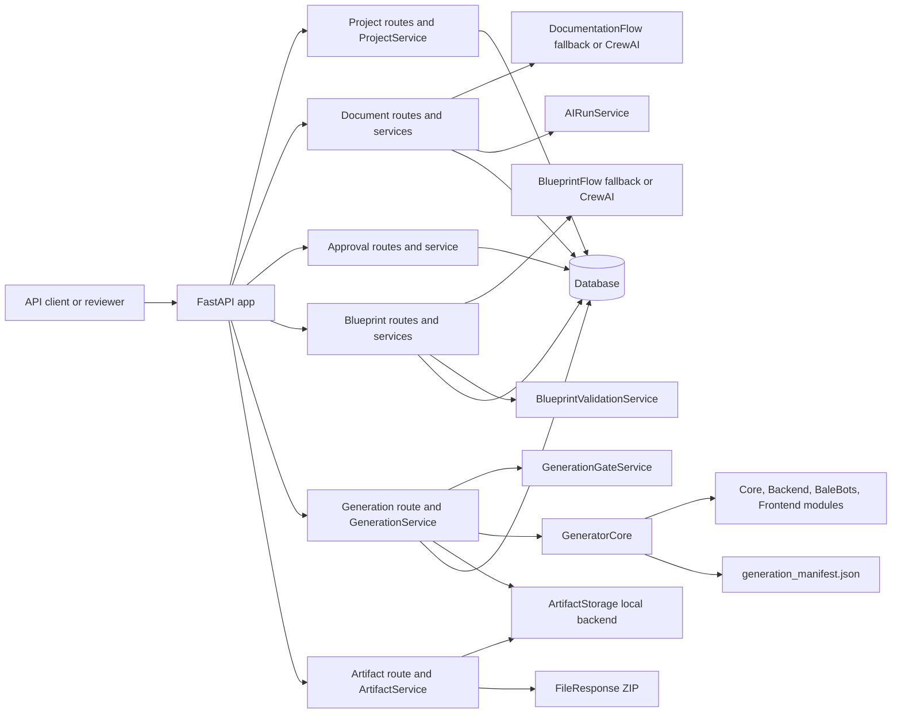

# Architecture Overview

BaleCrewBuilder is a documentation-first Builder Platform. It uses AI only to
draft structured project documents and optional Blueprint proposals, then relies
on human approval, schema validation, and deterministic templates to generate a
Bale bot project.

## Builder Platform Modules

| Area | Main code | Responsibility |
|------|-----------|----------------|
| FastAPI app | `app/main.py`, `app/api/routes/` | Mounts the REST API for projects, documents, reviews, blueprints, generation runs, and artifact downloads. |
| Project workflow | `app/services/project_service.py` | Owns project status transitions and prevents bypassing document/Blueprint gates. |
| Documents | `app/api/routes/documents.py`, `app/services/document_service.py`, `app/services/ai_run_service.py` | Stores Project Bot Documents, runs documentation flow, records AI run status, and supports upload/manual document creation. |
| Reviews | `app/api/routes/approvals.py`, `app/services/approval_service.py` | Records human review decisions and moves projects through document approval states. |
| Blueprints | `app/api/routes/blueprints.py`, `app/services/blueprint_service.py`, `app/services/validation_service.py` | Stores Bot Blueprints, optionally proposes Blueprints from approved documents, and validates them before generation. |
| Generation | `app/api/routes/generator.py`, `app/services/generation_service.py`, `app/generator/` | Runs deterministic generation from a validated `BotBlueprint`, records run/artifact metadata, and packages output. |
| Artifacts | `app/api/routes/artifacts.py`, `app/services/artifact_service.py`, `app/services/artifact_storage.py` | Resolves the latest completed ZIP artifact and returns it through `FileResponse`; local filesystem storage is the current backend. |

## Data Flow

1. `POST /projects` creates a project in `DRAFT_CREATED`.
2. A Project Bot Document is created manually, uploaded, or generated through
   `POST /projects/{project_id}/documents/generate`.
3. A reviewer submits the document for review and approves it. Blueprint
   generation is blocked until the project reaches `DOCUMENT_APPROVED`.
4. `POST /projects/{project_id}/blueprint/generate` creates a placeholder or
   AI-assisted Blueprint proposal from the approved document, or
   `POST /projects/{project_id}/blueprint` stores a manually supplied Blueprint.
5. `POST /projects/{project_id}/blueprint/validate` runs Blueprint validation.
   Code generation is blocked until the project reaches `BLUEPRINT_VALIDATED`.
6. `POST /projects/{project_id}/generate` runs `GeneratorCore` with the stored
   validated Blueprint, writes generated files, creates artifact metadata, and
   creates a ZIP artifact when `output_format=zip`.
7. `GET /projects/{project_id}/runs` lists generation runs newest first.
8. `GET /projects/{project_id}/download` returns the ZIP artifact for the latest
   completed generation run.

## Component Diagram

## Gate Boundaries

The Builder Platform keeps two hard gates:

- Blueprint proposal/storage requires an approved Project Bot Document.
- Deterministic generation requires a validated Blueprint.

The generator does not call an LLM and does not generate files from raw prompt
text. It consumes only a `BotBlueprint` that passes schema and semantic
validation.
